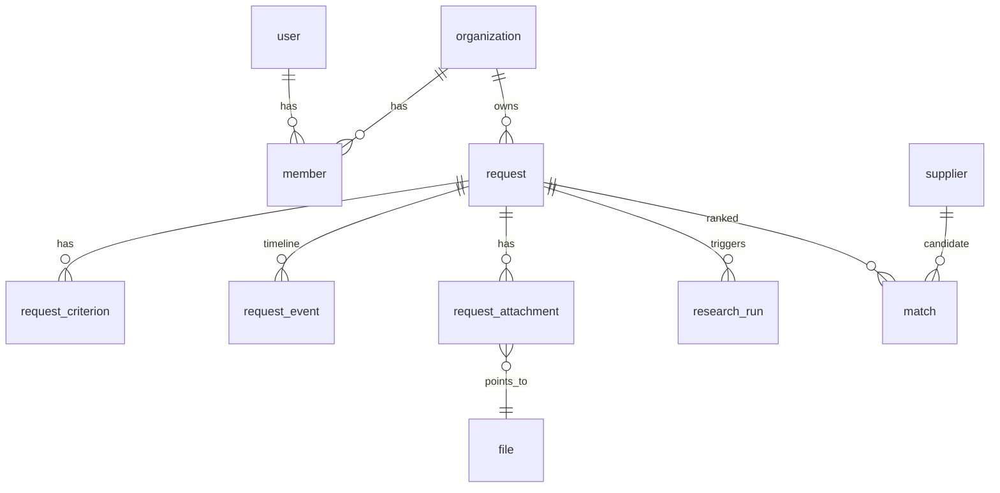
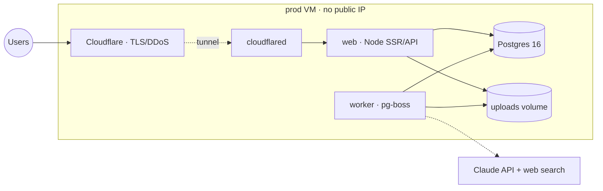

# OSI — Oversea Sourcing Intelligence

A **facilitated marketplace** for industrial sourcing. A buyer describes a need in
plain language; the platform extracts structured criteria, searches the web for
real manufacturers, and ranks the most compatible ones. When the buyer picks a
supplier, **OSI steps in as facilitator** — introduction, coordination, then
transaction tracking through to delivery.

Live at **[osi-solutions.com](https://osi-solutions.com)** · TanStack Start
(Vite · React 19 · Nitro SSR) · Postgres 16 · bilingual **FR / EN**.

> This README is the single reference for the project: what it is, how it works,
> how to run it, and why it is built this way. **[`doc/BACKLOG.md`](doc/BACKLOG.md)
> is the companion** — current state, what is done, and what is left to reach MVP1.
>
> **Working today:** the full request loop — criteria (typed *and* from attached
> spec sheets) → real web research → shared supplier pool → criteria-aware
> ranking → printable report, with per-workspace plans and daily quotas.
> **Not built:** facilitation (engagements), transactions, documents,
> notifications, and the supplier import pipeline.

Built with [Lovable](https://lovable.dev)
([editor](https://lovable.dev/projects/a2274c53-10c7-432f-8ad5-d1aeff813df3));
pushes to `main` sync back into Lovable, so avoid rewriting published history.

---

## 1 · The product

**Two-sided eventually, buyer-first now.** MVP1 covers the buyer journey; the
facilitation handoff is the bridge to the supplier side. Multi-tenant buyer
workspaces from day one. Payments are **track-only**; escrow is deferred.

**Public landing, gated action.** `/` needs no login — anyone can type their
need. Clicking *Lancer la recherche* is the auth gate: the draft is preserved
across login/signup and the request is created automatically afterwards. Every
other route requires auth.

### Supplier data strategy (hybrid)

The supplier pool is **platform-global** — OSI's shared asset, enriched by every
request — while requests, engagements and documents are tenant-scoped.

1. **Import pipeline** — baseline coverage from B2B directories, trade
   registries, customs data. *(Not built; the seed script stands in.)*
2. **Live AI web research** — ✅ *live since 2026-08-16.* Per request, an agent
   searches the web, extracts candidate suppliers, and **enriches the database as
   a byproduct**. Every request grows the dataset, so repeat searches in a
   category get cheaper: the DB is the cache.

Consequences, all first-class rather than afterthoughts:

- Every supplier carries **provenance** — `imported` · `ai_researched` · `osi_verified`
- **Confidence** maps to verification level and profile completeness
- **Dedup / entity resolution** is a core subsystem — a unique index on a
  normalized `name|COUNTRY` key, so a repeat search cannot re-add a known company

### Plans & quotas

Limits live in **`plan` rows, not in code or env** — changing what the Free tier
gets is an `UPDATE` from `/interne/plans`, live on the next request, no deploy.

| | Free | Pro | Business | Internal |
|---|---|---|---|---|
| Requests / day | **1** | 10 | 50 | **0 = unlimited** |
| Suppliers returned | 5 | 10 | 20 | 10 |
| Model tier | `cheap` | `best` | `best` | `best` |

`0` means unlimited so the internal plan needs no special case, and an accidental
`0` reads as "no cap" rather than silently locking every buyer out. A workspace
with **no** subscription falls back to the env values, so dev works with an empty
`plan` table.

Quota is enforced in `createRequestFn` — the single choke point every request
passes through, including the post-login auto-create — **before** the insert, so
a refusal leaves no half-created dossier and the buyer keeps their typed text. It
counts `request` rows in a **rolling 24h window** rather than a counter column:
always accurate, nothing to reconcile, and no "two requests at 23:59" hole that a
calendar reset leaves. The allowance returns when the *oldest* request in the
window ages out.

Plan rows are seeded in a **migration**, not the seed script — prod runs
migrations on every deploy and never runs `db:seed`.

> Staff and demo workspaces are moved to `internal` by that migration. With
> `SHOW_TEST_LOGIN=true` and public credentials, `buyer@osi.dev` on the free tier
> would mean one stranger burns the day's allowance and the demo is dead.

**Billing is not wired.** Plans and enforcement work without a payment provider;
`subscription.current_period_end` and the provider columns stay null until Stripe
(or equivalent) lands.

### Roles

**Workspace roles** (buyer companies): `owner` · `admin` · `buyer` · `viewer`.

**Platform roles** (OSI employees, on `user.platform_role`): `owner` (full
control) · `manager` (ops) · `accountant` (finance) · `user` (regular buyer,
default).

**One dashboard for everyone** — there is no separate admin app. Every user gets
the same shell; features are added or removed by role, mapped in
[`src/lib/roles.ts`](src/lib/roles.ts). Buyers see their own workspace only;
`owner`/`manager` see all sourcing dossiers; `accountant` is **forbidden** from
buyers' dossiers — their domain is finance.

Employee surfaces split into **"Vue globale"** / **"Mes données"** via the shared
`EmployeeTabs` component.

**Nav gating:** entries whose feature has no data behind it render **disabled** —
greyed, `aria-disabled`, emitted as a `<span>` rather than a styled link so they
cannot be reached by keyboard or middle-click — rather than being hidden or
linking to an empty page.

---

## 2 · How a request works

```
draft → received → searching → validating → report_ready → closed
                                    ↓
                              (cancelled)
```

Guarded transitions live in [`src/lib/request-status.ts`](src/lib/request-status.ts);
illegal ones throw. Every change writes a `request_event` row, so timelines,
activity feeds and dashboard stats are **pure read-models of the DB**.

1. **Create** (`createRequestFn`) — the hero prompt inserts a `request` (ids from
   `request_id_seq`, `#3000+`) and **parses criteria synchronously at intake**
   ([`parse-criteria.ts`](src/server/parse-criteria.ts) — deterministic regex,
   instant, zero tokens, editable afterwards). There is no pre-search AI analysis
   *(removed 2026-08-05)*; an ℹ️ helper on the prompt guides buyers to structured
   input instead. With attachments, the pipeline is held until the upload
   finishes, then released.
2. **Research** (worker, `searching`) — reads any attachments, runs a **real web
   search**, and inserts newly-found companies as `ai_researched` suppliers,
   deduped on `supplier.dedup_key`.
3. **Match** — scores the pool against the request's criteria and persists a
   ranked Top-N in `match`, with the per-criterion reasoning in `score_breakdown`.
4. **Report** — `/demandes/$id/rapport` renders the need, criteria, ranked
   suppliers and methodology, with PDF export via the browser's print pipeline.
5. **Recovery sweep** — on boot and every 60 s the worker re-adopts requests
   stranded mid-pipeline (crash, lost enqueue) and runs them to completion.

### Attachments are read, not just stored

A sourcing need often lives in a spec sheet rather than a textarea. Text/CSV are
decoded directly (zero tokens); PDFs and images are read by the model. Criteria
found in them are parsed with the **same intake regexes**, so a criterion from a
PDF is indistinguishable from a typed one, and the content also feeds the search
brief. See [`src/server/attachments.ts`](src/server/attachments.ts).

### Scoring

```
10 base
+55 × criteria coverage        (required criteria weighted ×2)
+20 × confidence / 100
+12 verified · +5 pending · 0 unverified · −25 rejected
−0 / 4 / 10                    risk: low / medium / high
```

Numeric criteria (pressure, flow, quantity, lead time) are recorded as
**`unverifiable`** and excluded from the denominator rather than counted as
misses — a one-line supplier description cannot evidence "16 bar", and scoring
absence as failure penalises every supplier equally. They become checkable when
the capability/certification satellite tables exist.

---

## 3 · Running it

Everything operational is a script in [`scripts/`](scripts). Config is a single
**gitignored** `.env` holding config *and* secrets — `cp .env.example .env` to
start.

| Situation                        | Command                                                                    |
| -------------------------------- | -------------------------------------------------------------------------- |
| **New machine, first time**      | `./scripts/setup.sh` — checks Docker, creates `.env`                       |
| **Develop locally** (hot-reload) | `./scripts/dev.sh` → http://localhost:3010                                 |
| **Test the prod image locally**  | `./scripts/prod.sh` → http://localhost:3010 (stop dev first — same port)   |
| **Stop local stacks**            | `./scripts/stop.sh [dev\|prod\|all]` (volumes kept)                        |
| **Query the database**           | `./scripts/db.sh [dev\|prod] [-c "SQL"]` — psql shell by default           |
| **Provision a (new) prod VM**    | `./scripts/setup-vm.sh` — Docker check, clone, `.env`                      |
| **Deploy to prod**               | `./scripts/deploy.sh` — pull `main`, rebuild, restart, health-check        |
| **See what's running where**     | `./scripts/status.sh` — local + VM containers & health                     |
| **Follow logs**                  | `./scripts/logs.sh [dev\|prod]` · `./scripts/logs.sh --remote`             |
| **Enable optional infra**        | `./scripts/addons.sh [--remote] storage monitoring …`                      |
| **Disable optional infra**       | `./scripts/addons.sh [--remote] --down` (never touches the app)            |
| **Back up the database**         | `./scripts/backup.sh [--local]` → `./backups/`                             |
| **Restore a backup**             | `./scripts/restore.sh <dump> --local\|--remote` _(destructive, confirmed)_ |

Remote scripts default to `DEPLOY_HOST=yves@192.168.2.56`,
`DEPLOY_PATH=/home/yves/workspace/apps/oversea-sourcing`, `WEB_PORT=3010`,
`BRANCH=main` — override per run: `BRANCH=hotfix/x ./scripts/deploy.sh`.

> **Every prod push updates [`doc/BACKLOG.md`](doc/BACKLOG.md) and this README in
> the same commit.** With no CI and no staging, these files are the only durable
> record of why prod looks the way it does. Check off what shipped, record the
> decision, name the deviation.

```sh
# Day-to-day
./scripts/setup.sh && ./scripts/dev.sh

# Ship to production — docs updated in the same commit
git push && ./scripts/deploy.sh && ./scripts/status.sh
```

Without Docker: `npm install && npm run dev` → http://localhost:8080 (Vite's own
port; Docker maps it to 3010). Other scripts: `build`, `preview`, `lint`,
`format`, `typecheck`.

### Configuration

Required in `.env`: `POSTGRES_PASSWORD`, `DATABASE_URL`, `BETTER_AUTH_SECRET`
(32+ chars), `BETTER_AUTH_URL`, `ANTHROPIC_API_KEY`. Dev uses safe database
defaults from `docker-compose.dev.yml`, so a fresh clone needs only
`cp .env.example .env` plus the API key.

> ⚠️ `POSTGRES_PASSWORD` applies **only when the volume is first initialised**.
> Changing it later does not change the database's password — it just breaks
> `DATABASE_URL`, and drizzle-kit reports the failure as a silent `exit 1`.

> ⚠️ `BETTER_AUTH_URL` **must be the public origin in production**
> (`https://osi-solutions.com`), or better-auth rejects logins from the domain
> with `INVALID_ORIGIN`.

| Setting              | Default    | What it does                                                                          |
| -------------------- | ---------- | ------------------------------------------------------------------------------------- |
| `AI_RESEARCH`        | **`true`** | Real web search per request. Off falls back to a simulated search stage               |
| `AI_CHAT`            | `false`    | Per-request assistant chat. Off hides the UI and the server refuses messages          |
| `ANTHROPIC_MODEL`    | `cheap`    | Tier (`cheap`/`balanced`/`best`) or a raw model id — registry in `ai/models.ts`        |
| `SUPPLIERS_RETURNED` | `5`        | Suppliers shown per dossier. **Search count and candidate caps derive from it**       |
| `SHOW_TEST_LOGIN`    | `true`     | One-click demo login on `/login`. **Set false before real users** — creds are public  |

Measured 2026-08-16 on identical requests: `cheap` (haiku-4-5, 3 searches) ≈
**$0.06** · `best` (opus-5, 6 searches) ≈ **$0.20** · `balanced` (sonnet-5, 6) ≈
**$0.21** — no cheaper than `best` despite a 60% lower rate, because it spent
2.5× the output tokens. `cheap` finds roughly half as many companies and lets the
odd directory through.

### Database

Postgres 16 (+pgvector) with Drizzle. Migrations run automatically on every `up`
via the one-shot `migrate` service.

```sh
npm run db:generate   # after editing src/database/schema.ts
npm run db:migrate    # compose does this automatically
npm run db:studio     # browse the dev database

# Seed demo accounts (dev) — password: osi-demo-1234
docker compose -f docker-compose.dev.yml exec web npm run db:seed
# owner@ · manager@ · accountant@ · buyer@osi.dev  (+ a 12-supplier pool)
```

---

## 4 · Architecture

**Modular monolith with physical seams.** One codebase, but every module sits
behind an interface that could become a network boundary — extraction is a deploy
change, not a refactor.

| Concern      | Choice                                                              |
| ------------ | ------------------------------------------------------------------- |
| Web / API    | TanStack Start monolith (Nitro server *is* the API host)             |
| Database     | PostgreSQL 16 + pgvector, Drizzle + drizzle-kit                     |
| Jobs         | **pg-boss** — the queue lives in Postgres, no Redis to operate       |
| Auth         | **better-auth** + organization plugin (`organization` = workspace)   |
| Validation   | **zod** on every server-fn boundary                                  |
| AI           | Claude via the `src/server/ai/` gateway                              |
| File storage | Local volume behind an S3-shaped adapter                             |

**Hard rules that make this work:**

- Domain code never imports a vendor SDK directly — always through an adapter
- Every job idempotent (safe to retry); every handler workspace-scoped
- One image, three processes: `web`, `worker`, one-shot `migrate`

### Module map and extraction seams

| Module            | Lives in                                   | Seam when overloaded                                        |
| ----------------- | ------------------------------------------ | ----------------------------------------------------------- |
| Web/SSR + API     | Node container (Nitro)                     | Stateless → replicate behind the proxy                       |
| Workers           | Separate container, same image             | Scale replicas; per-queue concurrency                        |
| AI gateway        | `src/server/ai/` — sole owner of Claude calls, retries, cost metering, model tiering | Own service if several apps consume it |
| **Research agent** | ⚠️ **Inline in the pipeline job** — the plan calls for its own `research` queue from day one. Known deviation; move it before load, not after | Dedicated queue + worker pool |
| Database          | Postgres container + named volume          | pgbouncer → dedicated local DB VM (no managed cloud PG)      |
| File storage      | Local volume, S3-shaped adapter            | Same code → MinIO / R2 / S3                                  |
| Search            | Postgres FTS + trigram                     | Meilisearch when the directory outgrows SQL                  |

### Where overload hits first

| # | Hotspot                | Symptom                                   | Lever (designed in)                                             |
| - | ---------------------- | ----------------------------------------- | ---------------------------------------------------------------- |
| 1 | **AI research**        | Requests stuck in `searching`; rate limits | Own queue + concurrency; worker replicas; **the DB is the cache** |
| 2 | **Claude cost/limits** | Bill spikes, 429s                          | Model tiering, budget guards, prompt caching                     |
| 3 | **Postgres**           | Slow matching, connection exhaustion       | Indexes on every `workspace_id` (day one); pgbouncer            |
| 4 | **SSR under traffic**  | Slow TTFB                                  | Replicate web containers (stateless by rule)                     |

---

## 5 · Data model

**Tenancy rule:** every buyer-facing query is workspace-scoped. **Exception by
design: `supplier` and its satellites are platform-global.**



| Table                | Key fields                                                                                                                              |
| -------------------- | --------------------------------------------------------------------------------------------------------------------------------------- |
| `user`               | email (uq), name, locale, **`platform_role`** `user\|owner\|manager\|accountant`                                                          |
| `organization`       | name, slug — **the workspace** (better-auth organization plugin)                                                                         |
| `member`             | organization_id, user_id, role `owner\|admin\|buyer\|viewer`                                                                             |
| `request`            | organization_id, created_by, title, description_raw, **status**, locale, compatibility_score, launched_at, completed_at                   |
| `request_criterion`  | request_id, category `material\|flow\|pressure\|certification\|quantity\|lead_time\|other`, label, value, unit, required, source `ai\|user` |
| `request_event`      | request_id, organization_id, type (`status.*`, `research.*`, `criteria.*`), message (JSON params)                                        |
| `supplier`           | name, descriptor, country_code, website, description, **provenance**, **verification_status**, confidence_score, risk_level, source_ref, **`dedup_key` (uq)**, **`discovered_by_request_id`** |
| `match`              | request_id, supplier_id, rank, compatibility_score, confidence_score, risk_level, status, **`score_breakdown` jsonb** — uq(request, supplier) |
| `research_run`       | request_id, status `running\|succeeded\|failed`, queries jsonb, candidates_found, suppliers_added, error                                  |
| `file` / `request_attachment` | organization-scoped file store; bytes behind `src/server/storage.ts`                                                            |

**Not yet built:** `engagement`, `transaction`, `document`, `notification`,
`sourcing_rules`, `audit_log`, `import_run`, and the supplier satellites
(capabilities, certifications, contacts).

---

## 6 · Infrastructure

Single VM (`192.168.2.56`), docker compose. Public ingress and TLS via a
**Cloudflare Tunnel** (`cloudflared`) on **osi-solutions.com** — the app
container is never internet-exposed and the VM needs no public IP.



**Decisions that shape this** — all deliberate, all reversible on a signal:

- **No cloud provider.** Local/own VMs behind the tunnel at every stage; scaling
  means more local hardware, not a migration.
- **No CI, no image registry.** Builds are local everywhere; the VM pulls `main`
  and builds its own image. Rollback = `git checkout <sha>` + rebuild.
- **No staging.** Dev and prod only; rehearse risky migrations on a dev restore
  of a prod dump.
- **Not Kubernetes.** If orchestration is ever needed, Docker Swarm across local
  VMs — compose files translate almost as-is.

Optional components (MinIO, Redis, Meilisearch, Uptime-Kuma, Dozzle, ClamAV,
Adminer) are **profile-gated** in `docker-compose.addons.yml` — nothing starts
unless asked: `./scripts/addons.sh [--remote] <profile>`.

### Security baseline

- ✅ TLS + ingress via Cloudflare Tunnel; Postgres not exposed on host ports in prod
- ✅ **Signup abuse controls** — IP rate limits (3 signups/hour, 10 logins/5 min),
  honeypot field, disposable-domain and plus-addressing blocks
  ([`src/lib/signup-guard.ts`](src/lib/signup-guard.ts)). Real client IP resolved
  from `cf-connecting-ip` behind the tunnel
- ✅ Nightly `pg_dump`; restore drills via `scripts/restore.sh`
- ⚠️ Rate-limit storage is **in-memory** — per-process counters do not add up once
  the web tier is replicated; Redis is the swap
- ⬜ Email verification (needs a provider), 2FA, error tracking

---

## 7 · Internationalization

`react-i18next`; **French is the default**, English the fallback. All
user-facing text lives in `src/i18n/locales/{fr,en}.json` — never hardcode a
string in a component; add a key and use `t(...)`. The language toggle is in the
top bar and persists to `localStorage`.

Country names fall back to `Intl.DisplayNames`, so a supplier from any country
renders correctly without a translation entry.

---

## 8 · Project structure

| Path                          | Purpose                                                                        |
| ----------------------------- | ------------------------------------------------------------------------------ |
| `src/routes/`                 | File-based routes; `api/` for upload/download/auth                             |
| `src/lib/*-fns.ts`            | Server functions (requests, criteria, chat, suppliers, stats) — zod-validated   |
| `src/lib/*.ts`                | Pure, client- and server-safe logic (roles, status machine, dedup key, guards)  |
| `src/server/`                 | Server-only: auth, queue, matching, research, attachments, storage              |
| `src/server/ai/`              | **The only place that calls Claude** — gateway, model registry, research agent  |
| `src/server/sourcing-config.ts` | `SUPPLIERS_RETURNED` and everything derived from it                          |
| `src/worker.ts`               | Background worker entrypoint (pg-boss)                                         |
| `src/database/`               | Drizzle schema, migrations, seed                                               |
| `src/data/osi.ts`             | Remaining showcase data (transactions only — analytics is now DB-backed)        |
| `infra/Docker/`               | `web.Dockerfile` (database uses the pgvector image)                            |
| `scripts/`                    | Everything operational                                                          |
| `doc/BACKLOG.md`              | **What is done, in progress, and open**                                        |

---

## 9 · Open decisions

- **External supplier data sources & licensing** for the import pipeline
- **The concrete "32 compatibility criteria"** — needs a product workshop; the
  weighted v1 scorer stands in
- **Email provider** (Resend vs SMTP) — blocks email verification and invitations
- **Escrow / payment provider** (Phase 4)
- **`src/web/`** — the frontend lives at `src/`; moving it risks breaking Lovable
  editor sync, so it is deferred
