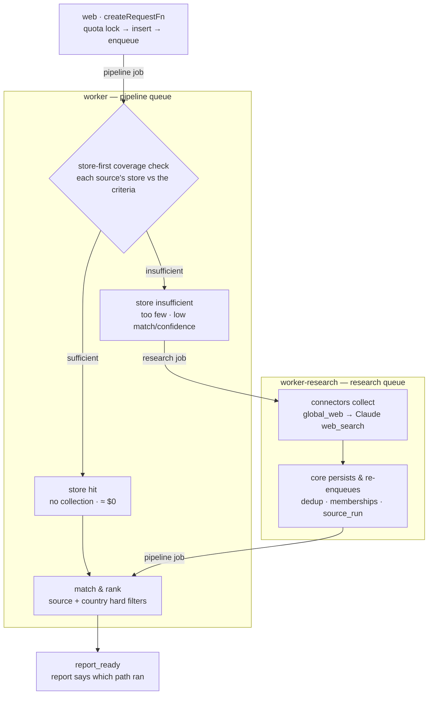
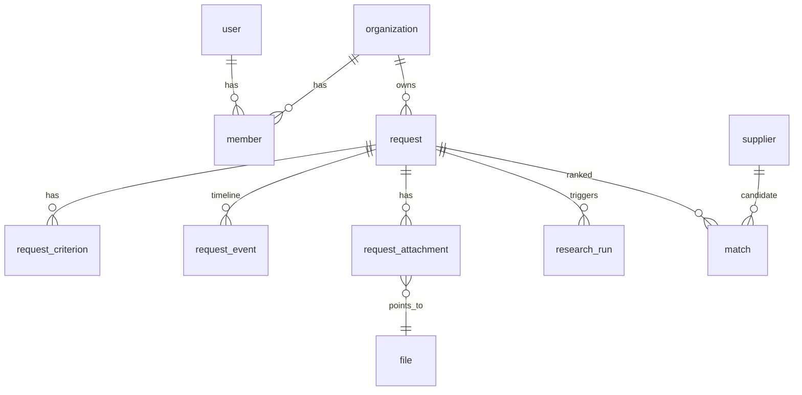
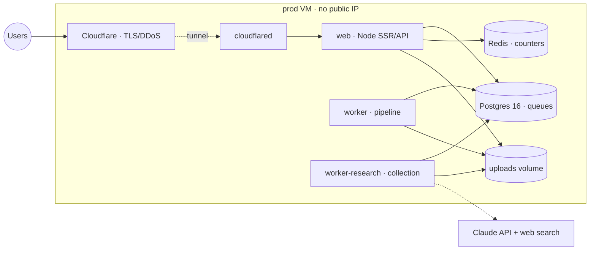

# OSI — Oversea Sourcing Intelligence

A **facilitated marketplace** for industrial sourcing. A buyer describes a need in
plain language; the platform extracts structured criteria, searches the web for
real manufacturers, and ranks the most compatible ones. When the buyer picks a
supplier, **OSI steps in as facilitator** — introduction, coordination, then
transaction tracking through to delivery.

Live at **[osi-solutions.com](https://osi-solutions.com)** · TanStack Start
(Vite · React 19 · Nitro SSR) · Postgres 16 · bilingual **FR / EN**.

> This README is the single reference for the project: what it is, how it works,
> how to run it, and why it is built this way. **[`doc/BACKLOG.md`](doc/BACKLOG.md)
> is the companion** — current state, what is done, and what is left to reach MVP1.
>
> **Working today:** the full request loop — criteria (typed *and* from attached
> spec sheets) → real web research → shared supplier pool → criteria-aware
> ranking → printable report, with per-workspace plans and daily quotas — and
> the first half of facilitation: the buyer solicits quotes, compares the
> offers, accepts one, and the dossier opens with its required contracts
> drafted (Phase P1-P4, live on prod since deploy #20).
> **Not built:** signatures, commandes and milestones, documents, paiements,
> messages, and the supplier import pipeline.

Built with [Lovable](https://lovable.dev)
([editor](https://lovable.dev/projects/a2274c53-10c7-432f-8ad5-d1aeff813df3));
pushes to `main` sync back into Lovable, so avoid rewriting published history.

---

## 1 · The product

**Two-sided eventually, buyer-first now.** MVP1 covers the buyer journey; the
facilitation handoff is the bridge to the supplier side. Multi-tenant buyer
workspaces from day one. Payments are **track-only**; escrow is deferred.

**Public landing, gated action.** `/` needs no login — anyone can type their
need. Clicking *Lancer la recherche* is the auth gate: the draft is preserved
across login/signup and comes back in the form — the buyer presses the button
themselves. It is deliberately NOT created automatically (owner 2026-08-29:
*"if not, cancel it, do not run, so we will not spend some token"*): a research
pass costs money, so launching one stays an act the buyer performs. Drafts
older than **1 h are discarded**, never resurrected — the draft exists to
carry someone across the login gate, not to be kept. Every
other route requires auth.

### Supplier data strategy (hybrid)

The supplier pool is **platform-global** — OSI's shared asset, enriched by every
request — while requests, engagements and documents are tenant-scoped.

1. **Import pipeline** — baseline coverage from B2B directories, trade
   registries, customs data. *(Not built; the seed script stands in.)*
2. **Live AI web research** — ✅ *live since 2026-08-16.* Per request, an agent
   searches the web, extracts candidate suppliers, and **enriches the database as
   a byproduct**. Every request grows the dataset, so repeat searches in a
   category get cheaper: the DB is the cache.

Consequences, all first-class rather than afterthoughts:

- Every supplier carries **provenance** — `imported` · `ai_researched` · `osi_verified`
- **Confidence** maps to verification level and profile completeness
- **Dedup / entity resolution** is a core subsystem — a unique index on a
  normalized `name|COUNTRY` key, so a repeat search cannot re-add a known company

#### ADR-001 — supplier provisioning is demand-pull (ACCEPTED 2026-08-26)

> **Status: ✅ DECIDED.**
> [doc/adr/ADR-001-supplier-provisioning.md](doc/adr/ADR-001-supplier-provisioning.md)
> is the decision record; **Phase S** in [doc/BACKLOG.md](doc/BACKLOG.md) is
> the implementation plan. The sections below this one describe the built
> machinery — still mechanically accurate, but **their roles are redirected
> where they conflict with the ADR**.

The strategy in one paragraph: **the demand-pull supplier graph.** Nothing
is spent on a supplier until a real request needs them (spend attaches to
*presented candidates*, never to collected records), and the facilitation
loop is the data-acquisition engine — deal outcomes (response time, MOQ,
lead time, quotes) are the unscrapable data that compounds per deal. The
supplier graph = the `supplier` table as node + dated, sourced, queryable
edges (capabilities→category, shipments, registry snapshots, certifications,
verification evidence, deal outcomes); the lifecycle
`lead → profiled → verified → engaged → partner` is *derived* from a node's
edges, never set by hand. Plain Postgres — "graph" is the shape, not the
engine.

Key redirections versus the sections below:

- **Source roles** (new axis, orthogonal to dynamic/static) — ✅ **BUILT
  2026-08-26 (migration 0018, `data_source.role`)**: *discovery* sources
  (`global_web`; customs and marketplaces later) stay workspace-selectable
  in Préférences de sourcing. **Registries are *verification*
  infrastructure** — never fed into matching (`resolveScope` filters to
  discovery), never in workspace settings (the Paramètres list + the save
  fn both scope to discovery); buyers meet them only as evidence lines on
  a supplier's profile ("Existence vérifiée — Registre du Québec, actif,
  consulté 2026-08"). Registry records therefore never need enrichment.
  `/interne/sources` shows each source's role; a verification source's
  "enabled" switch means "verification backend active", not buyer exposure.
- **Registry stores are kept** as local verification lookup tables,
  refreshed by scheduled full pull **~every 6 months per source** (staff
  upload for the file-fed QC/JP); evidence records the snapshot date;
  finalists get a live registry-API confirm where one exists. Registry
  coverage grows on demand — a new country's registry is added when
  discovery starts surfacing candidates there.
- **Discovery grows demand-first over genuinely FREE sources only** —
  **owner constraint (2026-08-26): no paid subscription to any data
  provider, ever; do not align any design with one.** Customs/BoL data —
  the ADR's original discovery backbone — is **closed for the US routes**
  (the 2026-08-26 investigation found every US access path paid), but the
  category stays open: **owner doctrine 2026-08-28 — bills-of-lading data
  joins the SEARCH category wherever a genuinely free route exists (free
  bulk or free API), in any jurisdiction.** `global_web` is and stays the
  DEFAULT search source, carrying discovery including the China corridor;
  new connectors are added only when a genuinely free, licensed source
  exists for a corridor buyers need. The availability-driven registry
  roadmap (Companies House → SIRENE → BRREG) stays retired. Since
  2026-08-28 `/interne/sources` presents the catalogue as the two
  categories — **Recherche** (search — feeds matching) and
  **Vérification** (registries — never matched).
- **Enrichment is lazy**: the ~3×N candidates a live request surfaces get a
  site-scrape + evidence-cited capability profile; keyword-scoped batches
  are the staff-aimed secondary; store-sized enrichment batches do not
  exist in this design.
- **Verification battery (= the E10 spec)** — ✅ **v1 BUILT 2026-08-26
  (S5b, migration 0020)**: every supplier presented on a Top-N gets the
  free checks — legal existence (offline lookup in the verification-role
  stores, evidence carries the registry name + snapshot date), digital
  identity (site alive, MX, RDAP domain age), OFAC SDN sanctions screening
  (local list, ≤7 days old; a hit derives `rejected`, −25, for staff
  review) — each writing one `supplier_verification` evidence row. The
  trust tier is DERIVED (`src/lib/verification.ts`: 0 unverified →
  1 existence verified → 2 capability evidenced → 3 Vérifié OSI via
  human_review) and projected onto `verification_status`
  (3→verified · 1-2→pending), whose ONLY writer is
  `src/server/verification.ts`. Runs async on the research queue right
  after promotion. The **E10 staff review surface is live too
  (`/interne/verification`, same day)**: battery evidence per supplier,
  sanctions alerts first, "Vérifier (Vérifié OSI)" writes the
  `human_review` row (→ verified, +12, the ✓ badge), "Retirer" deletes it.
  export_record is dormant (no-paid-data constraint) and certification
  joins when a free cert-registry route is added.
- **Intake goes form-first** — ✅ **BUILT 2026-08-26 (S1+S2, migration
  0019)**: the hero is now a structured form — product* and category*
  (required; the category select runs over the in-house taxonomy in
  `src/lib/taxonomy.ts`, 78 nodes with FR/EN labels + HS mappings, and
  auto-suggests from the typed text), plus quantity, material,
  certifications, lead time and a details textarea. Typed fields become
  criteria rows verbatim (source `user`; product and certifications
  required); details still pass the regex parser for extra specs;
  `request.category_id` stores the taxonomy node — the coverage/cache key.
  The auth-gate draft preserves the whole form as JSON. The plain-language
  hero remains a launch-time design task.

#### Data sources & sourcing preferences

> **Status: ✅ IMPLEMENTED (core 2026-08-22 · surfaces 2026-08-23/24) —
> roles redirected by ADR-001 above.** The
> engine is live: connector contract + registry (`src/server/sources/`),
> `global_web` as connector #1, per-source stores (`source_record`),
> `source_run` audit, the store-first request flow on its own `research`
> queue, country-scope plumbing end to end, the Paramètres
> sourcing-preferences UI writing `sourcing_rules` (B5), and the
> `/interne/sources` admin screen (enable/refresh/ban — C1). **Not yet
> built:** every connector beyond `global_web`.

**Data sources are a platform-level catalogue, curated by the platform
owner.** Each source is a row (`data_source`): a type — `global_web` (the AI
web research that runs today), `country_registry` (a national trade-registry
database or API), `import` (B2B directory / customs data files) — an optional
`country_code` (null = worldwide), and an enabled flag. The platform owner
turns sources on and off from an internal screen (`/interne/sources`, E10
sibling); a disabled source is never consulted for anyone. Suppliers keep a
`source_ref` to the source that found them — provenance already exists, this
makes it precise.

**Each account activates its sources once, in Settings — requests never
specify a source** (decided 2026-08-22). A workspace's sourcing preferences
(`sourcing_rules`, one row per workspace) say:

- **Activated sources** — the workspace switches on any of the
  platform-enabled catalogue (default: all of them). From then on **every
  request simply uses the activated set** — there is no per-request source
  picker; the choice is already made. A buyer who only trusts registry data
  deactivates the open web once; this never removes anything from the shared
  pool.
- **Supplier country origin** — where suppliers may come from:
  - `global` — all countries (default, today's behavior)
  - a **country list** — e.g. "China, Vietnam, India" for a buyer with a
    regional strategy, or a single country for **local sourcing**

Effective sources for any request =
**platform-enabled ∩ workspace-activated** — two layers, no third.

**Who consumes the preference:** the research agent scopes its web queries and
registry lookups to the preferred countries; the matcher excludes pool
suppliers whose `country_code` falls outside the preference (an excluded
supplier is filtered, not down-scored — a hard preference is a filter). The
preference applies at *request time* from the requesting workspace's settings;
the shared pool itself stays global — preferences shape what each tenant
*sees*, never what the platform *stores*.

##### Every source is an independent connector module

**Decided 2026-08-22.** Each data source is a self-contained module that does
exactly one thing: *when asked*, collect from its own source and return
candidates in the **one normalized format the platform understands**. The
platform never knows how a source works inside; a source never knows what the
platform does with its output.

```
src/server/sources/
  types.ts            ← the contract every connector implements
  registry.ts         ← data_source.code → connector module
  global-web/         ← connector #1: today's AI web research, refactored in
  registry-fr/        ← example: a French trade-registry API connector
  import-csv/         ← example: file-based directory imports
```

The contract (conceptually):

```ts
interface SupplierSourceConnector {
  /** Self-description — lets /interne/sources render any connector unseen. */
  meta: { code: string; type: "global_web" | "country_registry" | "import";
          countryCode?: string; name: string };
  /** The only entry point. Pull-only: runs when called, never on its own. */
  collect(brief: SearchBrief): Promise<SupplierCandidate[]>;
}
```

- **`SearchBrief`** — what the request needs: criteria, country scope, how
  many candidates are wanted. Same brief for every connector.
- **`SupplierCandidate`** — the single normalized output shape: name,
  `country_code`, website, description, evidence, plus the connector's raw
  payload kept as `source_ref` detail. It is exactly what the persistence
  layer already accepts from the research agent — dedup (`dedup_key`),
  provenance and confidence are applied by the **platform core after**
  collection, never inside a connector.
- **Pull-only** — a connector runs only when the pipeline (or an admin-triggered
  import) invokes it. No schedules, no background crawling inside connectors;
  if periodic imports are ever wanted, the *scheduler* calls the connector —
  the connector itself stays passive.
- **Isolation** — connectors are invoked with a per-connector timeout and
  fail independently: one broken registry API degrades that source's
  contribution, never the request. Each failure is recorded on the
  `research_run` (per-source outcome), so `/interne/sources` can show source
  health from real usage.
- **Adding a source = one module + one row.** Implement the interface, register
  it, insert its `data_source` row. Nothing in the pipeline, matcher, or UI
  changes. Conversely a `data_source` row whose connector is missing renders
  as unavailable rather than crashing.
- **The existing AI web research becomes connector #1** (`global_web`) —
  refactored behind this interface, proving the contract on day one. This is
  the same seam the INFRA principles already promised: a Tavily/Brave adapter,
  or any national registry, slots in without touching domain code.

##### The request flow across sources

> **Status: ✅ BUILT 2026-08-22** (thresholds are draft defaults — A8). AI web
> search is no longer the automatic path; it is one connector among peers.
> Each dashed region below is a container; every hop between them is a durable
> pg-boss job, never a direct call.



```
request enters `searching`
  1. Resolve effective sources: platform-enabled ∩ workspace-activated
  2. STORE-FIRST — match from each source's own store (its
     source_record candidates): fresh, non-banned, in country scope
  3. Live-collection fallback — ONLY when the store's answer is
     insufficient: too few candidates, match too low, or confidence too
     low — and only for sources that HAVE a live collector.
     Today that is global_web alone (AI web search); registry and
     import sources are store-only, refreshed by manual admin trigger
  4. Persist what a fallback collected: normalize → dedup → provenance
  5. Match & rank from the stores, WITHIN the source + country scope
```

- **Every source answers from its store first — `global_web` included**
  (decided 2026-08-22). The AI search goes to the internet only when its own
  store comes up short; a registry source never goes anywhere at request time
  — its store is whatever the last admin refresh collected.
- **The fallback triggers on quality, not just quantity:** too few candidates
  *or* compatibility scores too low *or* confidence too low. Local stored data
  always gets the first chance; the internet is for finding *new* suppliers,
  not re-finding known ones.
- **A8 decisions (settled 2026-08-22):** thresholds keep their defaults
  (2×Top-N candidates · score ≥ 40 · confidence ≥ 30 · fresh ≤ 90 days), all
  env-tunable without a deploy. **Cross-source order: sequential, catalogue
  order** — revisit parallel fan-out when a second live connector exists.
  Failure UX: sources fail independently; a fully failed collection still
  ranks the existing store. The field defects were fixed in the matcher
  instead of the thresholds: **numeric tokens must match** ("ISO 9001" no
  longer satisfies "ISO 8573-1") and **morphological aliases**
  ("inox" ↔ "inoxydable") — both under unit test.
- A workspace that activated only the Canadian registry never calls the AI
  search at all.
- **Source scope is a hard filter at match time**, exactly like country
  origin: a pool supplier known only from a non-activated source does not
  appear for that workspace — preferences shape what a tenant *sees*, never
  what the platform *stores*.

##### The two kinds of source, and the store→supplier promotion model

> **Status: ✅ BUILT 2026-08-24 (kinds + Phase D promotion, migrations
> 0012/0013).** Decided in discussion; do not re-derive differently.

**Every source is one of two kinds** — derivable from `data_source.type`
(`src/lib/source-kind.ts`), deliberately not a schema column:

- **Dynamic** (`global_web`): the dataset does not exist until asked — a
  request brief *generates* candidates. Fed **exclusively through requests**
  via the store-first fallback; never admin-triggered. Its store is a cache
  of past request-driven collections.
- **Static** (`country_registry`, `import`): the dataset exists independently
  of any request. **"Mettre à jour" = full pull** — the connector collects
  everything its source has, the core saves it, and idempotence comes from
  dedup, so every trigger is a complete, duplicate-free sync. No scope, no
  parameters.

**Stores are disposable; suppliers are promoted** (decided 2026-08-24):

- What a source collects is **kept in its store as raw records — candidates
  to become suppliers**, not suppliers yet.
- A record is **promoted** to a `supplier` row only when the platform
  actually uses it: it ranks into a request's Top-N (first trigger; staff
  pick and verification join later with E10). Promotion dedups through the
  same `dedup_key` unique index.
- Consequence, and the reason for the design: **a store can be wiped at any
  time without impacting the platform** — requests, matches, reports and
  engagements reference promoted suppliers only. Wipe, re-pull, nothing
  user-facing moves. The supplier pool becomes exactly "companies that have
  surfaced for buyers", not a mirror of anyone's dataset.
- Matching ranks **logical candidates**: store records deduped by
  `dedup_key` across the workspace's effective sources, merged with
  already-promoted suppliers. Unpromoted records are `unverified` by
  definition.

##### Per-source collections & bans

**One supplier entity, N source memberships** (decided 2026-08-22). The same
company will legitimately be found by several sources (registry + Alibaba +
web). Global dedup stays untouched; each source keeps its own **store** — the
supplier list it answers requests from — as membership rows:

```
source_record                          (Phase D, 2026-08-24)
  data_source_id  → data_source
  dedup_key                            (unique on the pair — groups the same
                                        company across sources)
  supplier_id     → supplier | null    -- set at PROMOTION only
  name / country / website / description / confidence / source_url
  status          active | banned
  first_seen_at / last_seen_at
  payload         jsonb                -- what THIS source said about the company
```

A source's collection is browsable in `/interne/sources` (count, freshness,
health). `supplier.source_ref` stays as "first discoverer".

**Bans, at two levels — both survive re-collection** (the dedup key lands new
encounters on the existing row, so the flag sticks; a banned supplier can
never be resurrected by a fresh crawl):

| Level | Where | Meaning |
|---|---|---|
| Per-source | `source_record.status = banned` | This source's data for this company is ignored; the company can still surface via other sources (junk Alibaba listing, fine registry record) |
| Global | `supplier.banned_at/by/reason` | Never matched, never shown, for anyone (fraud, sanctions) |

Bans are staff actions (owner/manager) with a who/when/why trail, managed from
the source's collection view.

##### Admin-triggered source updates

> **Status: ✅ BUILT 2026-08-24 (C1; semantics settled same day).** Facts a
> future session must not re-derive differently: the server fn creates the
> `source_run` row (`trigger=admin`, status `running`, `triggered_by`) so
> the screen shows it immediately, then enqueues `{sourceRunId}` on the
> **research queue** — collection always runs in `worker-research`, never in
> web. `runAdminRefresh()` (`src/server/research.ts`) persists through the
> exact request path. **Static sources only, always a full pull, no scope**
> (dynamic sources are refused — they are fed exclusively by requests; the
> initial category-scoped variant was superseded the same day). One admin
> run at a time per source; a **disabled** source can still be refreshed
> (warming a store before enabling it is a rollout move).

Connectors stay pull-only; **platform management is the second legitimate
caller** (the request pipeline being the first). From `/interne/sources`,
staff trigger **"Mettre à jour"** on one source, with a scope
(category, country) so a refresh is targeted. The run executes that one
connector, upserts `source_record` rows and refreshes
`last_seen_at` — an admin refresh literally re-warms the store. Audited as
**`source_run`** rows (source, trigger `request | admin`, who, counts,
errors) — this absorbs the previously planned `import_run`.

**Manual trigger is the only store update for now** (decided 2026-08-22) —
for store-only sources (registries, imports), staff refreshes are how their
supplier lists grow. Scheduled refreshes can come later; when they do, the
scheduler is just a third caller of the same connector — nothing else
changes.

##### Connector roadmap (integrate while going)

> **Superseded for *discovery* by ADR-001 (2026-08-26):** next connectors
> are demand-driven over **genuinely free sources only** (owner constraint:
> no paid data subscriptions, ever — customs/BoL is closed, see §9); the
> registries below are retained as **verification backends** (per-candidate
> lookups + ~6-monthly store refresh), not discovery sources. Rows #5/#6
> (registry-us, UK/FR/NO) are deprioritized to "when verification demand
> surfaces that country".

Each connector is coded independently and plugged in when ready — one module
+ one `data_source` row, nothing else changes:

| # | Connector | Note |
|---|---|---|
| 1 | `global_web` | ✅ Refactor of the existing AI research — proves the contract |
| 2 | `registry-ca` | ✅ 2026-08-24 — static full pull of the federal bulk open data (OGL): 643k active corporations streamed, numbered shells filtered, ~393k records loaded, idempotent by dedup. **Performance-safe to enable since C2b** (big-store SQL prefilter by criteria name tokens — measured 345 ms over 393k rows; shared vocabulary in `src/lib/match-tokens.ts`). Enabled in dev; **prod switch stays OFF as a product call** — name-matched records can store-hit and reach a Top-N as bare names until the enrichment agent exists |
| 3 | `registry-qc` | ✅ 2026-08-25 — first FILE-FED static source (the endpoint cannot be fetched autonomously): staff uploads the Registraire's ZIP on the source's tab, the pull parses Entreprise.csv + Nom.csv (NEQ join, active only, **activity descriptions** — records are genuinely matchable). Seeded disabled |
| 4 | `alibaba` | ⚠️ **ToS/licensing gate before coding** — marketplace access must be cleared legally first |
| 5 | `registry-us` | Investigated 2026-08-25 (README §9): no federal registry — v1 = SAM.gov public extract (free key, NAICS activity codes, autonomous pull); free-bulk states optional; Delaware/California closed. Not built |
| 6 | `registry-uk` · `registry-fr` · `registry-no` · more | Verified autonomous candidates with activity codes — priority Companies House → SIRENE → SAM.gov → BRREG; full access table in §9 "Autonomous-pull registry candidates". Not built |

#### Supplier cache — research reuse

> **Status: ✅ IMPLEMENTED 2026-08-22 (v1).** The coverage check runs in the
> pipeline before any research is enqueued (`evaluateStoreCoverage` in
> `src/server/research.ts`); "insufficient" means too few candidates, match
> too low, **or confidence too low** — thresholds in `sourcing-config.ts`,
> env-overridable (`STORE_MIN_CANDIDATES/_SCORE/_CONFIDENCE`, `STORE_FRESH_DAYS`).
> Verified in dev: a warm category answered with `research.store_hit`
> (14 qualifying of 19), zero AI cost, and the report says so.

When a request enters `searching`, the pipeline first scores the **existing
pool** against the request's criteria (within the workspace's country scope)
and picks one of three paths:

| Path | Condition | What runs |
|---|---|---|
| **Pool-only** | ≥ N fresh candidates above a score threshold | No AI research — matched from the pool, cost ≈ $0 |
| **Top-up** | Coverage thin or stale | Reduced research (1–2 searches) targeting the gaps |
| **Full research** | Poor coverage | Today's behavior |

N = the plan's `suppliers_returned` × 2, so ranking keeps choices.

- **Similarity fingerprint** — each `research_run` stores a normalized
  fingerprint (product category + key criteria + country scope). A new request
  matching a recent successful run's fingerprint is strong evidence the pool is
  warm, however the need was worded.
- **Freshness** — `supplier.last_researched_at`, touched whenever research
  re-encounters the company (a dedup hit proves it still exists). Entries older
  than **90 days** don't count toward coverage; they still match, but a top-up
  refreshes the category.
- **Honesty in the report** — the methodology section states which path ran:
  "matched from OSI's pool" vs "web research conducted on {date}". A pool
  answer is a feature, not a secret. Events: `research.skipped_cache`,
  `research.topped_up`.
- **Quota** — a pool-only request costs the same quota unit (decided): the
  buyer pays for the result, not the method; the saving is platform margin.

#### Visibility tiers & ranking — Vérifié / Recommandé

> **Status: VALIDATED 2026-08-22 — to implement.** The commercial tier, and
> the ground floor of the future supplier-side space.

Three buyer-facing tiers on top of `verification_status`:

| Tier | Badge | Granted by | Meaning |
|---|---|---|---|
| *(none)* | **nothing** — no badge, no "unverified" mention | default | In the pool, matched normally; absence of a badge is neutral |
| **Vérifié** | ✓ Vérifié | OSI staff (E10 verification workflow) | OSI checked the company exists and is what it claims |
| **Recommandé** | ★ Recommandé | **platform owner** — paid *or* discretionary (both allowed, case by case) | A partner OSI puts forward — the commercial tier |

**Recommandé is a partnership, not a verification status** — its own satellite
table, deliberately, because this is where the future supplier-side space
attaches (claimed profiles, supplier logins, partner dashboards — a
`claimed_by_user_id` lands here later, not in `supplier`):

```
supplier_partner
  supplier_id   (uq → supplier)
  status        active | expired | suspended
  source        paid | granted
  granted_by    → user (platform owner)
  starts_at / ends_at        -- time-boxed, renewable
  notes
```

Rules (all decided):

- **Recommandé requires Vérifié.** OSI cannot put its name behind an unchecked
  company — payment is the trigger, verification is the gate.
- **Expiry is read-time** — `ends_at` passes and the tier silently drops to
  Vérifié; no cron.
- **Ranking: relevance first, tier breaks ties.** "Equal ground" = same
  **5-point band** of compatibility score. Ordering: band (desc) → tier within
  the band (Recommandé > Vérifié > none) → exact score → deterministic
  tiebreak. A recommended supplier that matches poorly never outranks a nobody
  that matches well.
- **Recommandé adds zero score points.** Vérifié keeps its existing +12 (real
  evidence); paid visibility must not masquerade as computed compatibility.
  `score_breakdown` records band and tier, so every ranking stays explainable.
- **Disclosure** — the report methodology carries one line: *"Les partenaires
  Recommandés sont mis en avant à pertinence égale."* The badge plus this line
  keeps the ranking story honest (and aligns with P2B-style transparency rules
  if Recommandé is ever sold in the EU).
- Owner surface: **`/interne/partenaires`** — grant, renew, suspend, with the
  `granted_by` trail.

### Plans & quotas

Limits live in **`plan` rows, not in code or env** — changing what the Free tier
gets is an `UPDATE` from `/interne/plans`, live on the next request, no deploy.

| | Free | Pro | Business | Enterprise | Internal |
|---|---|---|---|---|---|
| Audience | individual | individual | organization | organization | internal |
| Requests / day | **1** | 10 | 50 | 100 | **0 = unlimited** |
| **Requests total (lifetime)** | **2 — then upgrade** | ∞ | ∞ | ∞ | ∞ |
| Seats (`max_members`) | 1 | 1 | 5 | 0 = custom | 0 |
| Quota scope | per user | per user | pooled | pooled | pooled |
| Suppliers returned | 5 | 10 | 20 | 20 | 10 |
| Model tier | `cheap` | `best` | `best` | `best` | `cheap` |

`0` means unlimited so the internal plan needs no special case, and an accidental
`0` reads as "no cap" rather than silently locking every buyer out. A workspace
with **no** subscription falls back to the env values, so dev works with an empty
`plan` table.

**Free is a trial** (✅ built 2026-08-23): 1 request per day AND **2 requests
total, ever** — after the second, the only path is a paid plan. The lifetime
cap is a plan column like everything else (`max_requests_total`, 0 =
unlimited), checked **before** the daily window at the same choke point (an
exhausted trial never comes back, so "try again at 14:00" would be a lie), and
the refusal is distinct: daily says "come back at {time}", lifetime says "your
free requests are used — upgrade".

**Quota scope** (✅ built 2026-08-23): individual plans count the **user's**
requests, organization plans pool the **workspace's** (`plan.quota_scope`).
Seats (`max_members`) are stored per plan; invitations get refused at the cap
when the invitation flow lands (B3).

**Subscription management** (✅ built 2026-08-23): the platform owner's screen
is **"Abonnements"** with one tab per audience — **Individuel** (Free, Pro) ·
**Organisation** (Business, Enterprise) · **Interne** (staff), driven by
`plan.audience`. Every column above is editable live with the cost estimate
and `updated_by` trail; audience-constrained *assignment* hardening comes with
the workspace-type revisit.

Quota is enforced in `createRequestFn` — the single choke point every request
passes through, including the post-login auto-create — **before** the insert, so
a refusal leaves no half-created dossier and the buyer keeps their typed text. It
counts `request` rows in a **rolling 24h window** rather than a counter column:
always accurate, nothing to reconcile, and no "two requests at 23:59" hole that a
calendar reset leaves. The allowance returns when the *oldest* request in the
window ages out.

Plan rows are seeded in a **migration**, not the seed script — prod runs
migrations on every deploy and never runs `db:seed`.

> Staff and demo workspaces are moved to `internal` by that migration. With
> `SHOW_TEST_LOGIN=true` and public credentials, `buyer@osi.dev` on the free tier
> would mean one stranger burns the day's allowance and the demo is dead.

**Billing is not wired.** Plans and enforcement work without a payment provider;
`subscription.current_period_end` and the provider columns stay null until Stripe
(or equivalent) lands.

### Sign-in

Email/password plus **Google — production only** (decided 2026-08-17). The code
is always present; the button appears when `GOOGLE_CLIENT_ID` and
`GOOGLE_CLIENT_SECRET` are both set, so dev simply leaves them out. Putting them
in dev would render a button that fails with `redirect_uri_mismatch` unless
`localhost` were also registered, and a broken affordance is worse than none.

The redirect URI Google must have registered is derived from `BETTER_AUTH_URL`:

```
https://osi-solutions.com/api/auth/callback/google
```

Exact string — scheme, host, path, no trailing slash. A mismatch is the single
most common failure. Scopes are `email profile openid` (non-sensitive, so no
Google review), and the consent screen must be **Published**, not left in
*Testing*, or only listed test users can sign in.

Google accounts arrive with `email_verified = true`. Note the signup guards
(honeypot, disposable domains, plus-addressing) only run on `/sign-up/email` —
the social route bypasses them, which is defensible since Google has verified
the address.

#### Email verification & password reset (E1 — ✅ built 2026-08-23)

Both flows are **better-auth built-ins configured in `src/server/auth.ts`**,
delivering through the SendGrid adapter (`src/server/mail.ts`). Implementation
facts a future session must not re-derive differently:

- **Verification**: `emailVerification.sendOnSignUp: true` sends a localized
  (by `user.locale`) email on every email/password signup. The link hits
  better-auth's own `/api/auth/verify-email?token=…&callbackURL=/` — no custom
  route; `autoSignInAfterVerification: true` signs the user in and lands them
  on `/`. A **resend** lives in Paramètres → Profil (unverified users see
  "renvoyer l'e-mail" → `authClient.sendVerificationEmail`).
- **Verification is ENFORCED at login since 2026-08-28** (owner: "at
  registration email should verify") — an unverified account cannot sign
  in; the blocked attempt re-sends the verification link
  (`sendOnSignIn: true`), so pre-enforcement accounts self-heal at their
  next login. This closes the free-tier multi-account hole (a trial now
  costs a real inbox). Demo accounts are seed-verified; Google arrivals
  are verified already.
- **Password reset**: login page carries "Mot de passe oublié ?" →
  `/mot-de-passe-oublie` (public) → `authClient.requestPasswordReset({ email,
  redirectTo: "/reinitialiser" })`. The page answers **the same whether the
  account exists or not** (no email enumeration — keep it that way). The
  email link goes through better-auth's `/api/auth/reset-password/:token`,
  which redirects to `/reinitialiser?token=…` (or `?error=INVALID_TOKEN`);
  that public page collects the new password (min 8, confirmed twice) and
  calls `authClient.resetPassword({ newPassword, token })`. Reset tokens
  expire in 1 hour (better-auth default).
- **Rate limits** already cover the endpoints: `/sign-up/email` 3/h,
  `/request-password-reset` falls under the global 60/min window plus the
  legacy `/forget-password` rule; counters live in Redis when `REDIS_URL` is
  set.
- **Public paths**: `/mot-de-passe-oublie` and `/reinitialiser` are in
  `PUBLIC_PATHS` (`src/lib/auth-guard.ts`) — everything else stays
  default-deny.
- **Mail delivery modes** (`src/server/mail.ts`): no `SENDGRID_API_KEY` →
  logged to stdout; `MAIL_SILENT=true` → logged even with a key (dev default
  today); otherwise real send via SendGrid v3 (plain fetch — no SDK, the
  adapter is the vendor seam). Failures return `{ok:false}`, never throw:
  a bounced email must not break a signup.
- **Verified end to end in dev** (2026-08-23): signup → logged verification
  email → link → `email_verified = true` + auto sign-in; forgot → logged
  reset email → link → new password → fresh login with it returned 200.

#### 2FA, password change & personal theme (2026-08-27)

Paramètres → **Profil** is the personal hub: name/language, **password
change** (better-auth `/change-password`, other sessions revoked), **2FA**
(better-auth `twoFactor` plugin, issuer OSI — enable shows the TOTP secret +
one-time backup codes and requires a first code before the flag flips; a
2FA login lands on the public bare `/2fa` page), and a **personal accent
theme** (5 palettes in `src/lib/themes.ts`; the stylesheet derives gradients
and the accent shadow from `--gold` via color-mix, so a theme is one
variable pair, applied by the root shell from the session).

**Platform roles are granted from `/interne/utilisateurs` (owner-exclusive)
or in the database — never at signup.** Granting through the UI also enrolls
the person into the internal OSI workspace; revoking removes that membership
and re-points their sessions (`setPlatformRoleFn`, audited). `platformRole`
is declared `input: false`, so a signup payload cannot request it — otherwise
anyone could register as platform owner:

```sql
UPDATE "user" SET platform_role = 'owner' WHERE email = '…';
```

The change takes effect on the next sign-in, since the role is read from the
session established at login.

### Roles

**Workspace roles** (buyer companies): `owner` · `buyer` · `viewer` (owner/admin merged 2026-08-23 — the owner manages account AND team).

**Platform roles** (OSI employees, on `user.platform_role`): `owner` (full
control) · `manager` (ops) · `accountant` (finance) · `user` (regular buyer,
default).

**One dashboard for everyone** — there is no separate admin app. Every user gets
the same shell. **Staff access is DATA since 2026-08-28**: what `manager` and
`accountant` may do lives in the `platform_permission` table (migration 0031),
toggled live by the platform owner from `/interne/utilisateurs` → **Rôles &
accès** (12 capabilities: the 9 features + source toggle, store wipe, journal
purge; every flip audited). The **owner always has everything** — hardcoded,
never a row, so the matrix cannot lock out its own editor — and **role
granting stays owner-only forever**. [`src/lib/roles.ts`](src/lib/roles.ts)
holds the keys and the fallback defaults; `src/server/permissions.ts` resolves
(30s cache); the session ships the resolved set so nav and route guards follow
automatically, while server fns re-check per call. Buyers see their own
workspace only; `owner`/`manager` see all sourcing dossiers; `accountant` is
**forbidden** from buyers' dossiers — their domain is finance.

Employee surfaces split into **"Vue globale"** / **"Mes données"** via the shared
`EmployeeTabs` component.

**The shell (2026-08-28):** account concerns live in the **header** — the
top-right avatar opens the profile menu (`UserMenu.tsx`: name, email, staff
role badge, Paramètres link, déconnexion) next to the always-visible
workspace badge, the language toggle and the notification bell. The
**sidebar is navigation only**; anonymous visitors get a "Se connecter"
button at its bottom.

**Nav gating:** entries whose feature has no data behind it render **disabled** —
greyed, `aria-disabled`, emitted as a `<span>` rather than a styled link so they
cannot be reached by keyboard or middle-click — rather than being hidden or
linking to an empty page.

### Account model — Individual & Enterprise (SaaS)

> **Status: VALIDATED 2026-08-22 — to implement.** Nothing here is built
> beyond what is explicitly marked as existing. The use cases are the E2/E12
> implementation checklist in [doc/BACKLOG.md](doc/BACKLOG.md); the decisions
> at the end of this section are settled (only Q4, enterprise pricing, stays
> open as a business call).

> **Made explicit 2026-08-26 (owner):** `organization.type` now carries the
> account model in the schema — `internal` (the one staff workspace,
> **"Oversea Sourcing Intelligence"**, slug `osi`, seeded by migration 0022
> with every platform staff member on the internal plan) · `individual`
> (personal workspace created at signup) · `enterprise` (a buyer company's
> shared workspace). A buyer account is individual OR organisation — the
> signup UX for that choice is the open design item.

#### The idea in one paragraph

OSI becomes a two-tier SaaS: an **Individual account** is what exists today — a
person signs up and gets a personal workspace with a plan (Free by default). An
**Enterprise account** is a shared workspace owned by a company: one
subscription, many user accounts inside it, invited or created by the workspace
owner, each with rights the owner chooses (manage the account, create requests,
read-only). The enterprise owner gets a managerial view of the team's sourcing
activity and usage.

**Why this is mostly wiring, not building:** the tenancy model was designed for
this from day one. `organization` *is* the workspace, `member` already carries
the roles (`owner | buyer | viewer`; `admin` schema-valid but unused), the `invitation` table
already exists in the schema (better-auth organization plugin — never wired to
any UI), and plans/quotas already attach to the workspace, not the user. What
is missing is the surface: invitation flows, a team screen, role enforcement
helpers, and the managerial view. That is exactly backlog **E2** ([doc/BACKLOG.md](doc/BACKLOG.md)), plus the
Enterprise items added to **E12** on 2026-08-20.

#### Who is who — the three populations

| Population | Identified by | Examples | Powers come from |
|---|---|---|---|
| **Platform staff** (OSI employees) | `user.platform_role` = `owner` · `manager` · `accountant` | ops running facilitation, finance | [`roles.ts`](src/lib/roles.ts) feature map — internal surfaces, all-tenant visibility |
| **Customer — Individual** | regular `user` (+ personal workspace, 1 member) | a solo buyer on Free/Pro | their `member.role` in their own workspace |
| **Customer — Enterprise** | regular `user`s sharing a company workspace | a purchasing team on Business/Enterprise | their `member.role` in the company workspace |

The two axes never mix: `platform_role` is granted only in the database and
gives OSI-internal powers; `member.role` is granted by the workspace owner
and gives powers **inside that workspace only**. A staff member who also buys
would simply have both — like `yves@overseaimportexports.com` today (platform
`owner` + owner of his own workspace).

#### Account types (customers)

| | Individual | Enterprise |
|---|---|---|
| Workspace | Personal, created at signup | Company workspace, shared |
| Members | Exactly 1 (the person) | Many; invited/created by the owner |
| Who pays | The person (Free/Pro) | The company (Enterprise plan) |
| Quota unit | **Per user** (= per workspace, since 1 member) | **Pooled per workspace**, with optional per-member ceilings |
| Managerial view | — | The owner sees all team requests + usage |
| Plans | Free · Pro | Business · Enterprise |

An individual account is not a separate concept in the database — it is simply
a workspace with one member. Nothing about today's signup flow changes.

#### Workspace roles and rights

**Three roles** (decided 2026-08-23: `owner` and `admin` merged — the owner
manages both the account and the team; no separate admin tier). The `admin`
string remains schema-valid in `member.role` so reintroducing the tier later
is non-breaking, but nothing grants it and guards rank it like `buyer`.

| Right | `owner` | `buyer` | `viewer` |
|---|---|---|---|
| Manage the account (plan, billing, rename, delete, transfer) | ✅ | — | — |
| Invite / create members, assign roles, remove members | ✅ | — | — |
| See all the team's requests, reports & usage (managerial view) | ✅ | — | — |
| Create sourcing requests | ✅ | ✅ | — |
| See own requests & reports | ✅ | ✅ | — |
| See requests shared with the workspace | ✅ | ✅ | ✅ |
| Edit sourcing preferences (sources, country origin) | ✅ | — | — |

Rules that keep this simple:

- **Only organisations invite** (owner rule 2026-08-27): an individual
  workspace is one person by definition — the Utilisateurs tab is hidden
  there and `beforeCreateInvitation` refuses server-side
  (`INVITE_NOT_ALLOWED_INDIVIDUAL`).
- **Exactly one `owner` per workspace.** Ownership transfers, it does not fork.
  (Transfer is an owner-only action; the previous owner becomes `buyer`.)
- Roles are per-workspace: the same user can be `owner` of their personal
  workspace and `buyer` inside an enterprise.
- Workspace roles are unrelated to `user.platform_role` (OSI staff). An
  enterprise owner has no OSI-internal powers, ever.

#### Use cases

##### UC-1 — Individual signup *(exists today, unchanged)*
A person signs up (email/password or Google). A personal workspace is created,
they are its `owner`, subscription = Free. Everything below is additive.

##### UC-2 — Create an enterprise workspace
An authenticated user clicks **"Créer un espace entreprise"** (Paramètres),
names the company, and becomes its `owner`. Their personal workspace is
untouched — they now belong to two workspaces and can switch between them (the
active workspace is session state; better-auth's org plugin supports this
natively). The enterprise workspace starts on a trial/Business plan until
billing lands (open question Q3).

*Acceptance:* switching workspaces re-scopes every list (requests, suppliers
links, stats) with no leakage between the two; the workspace switcher shows
both, with the active one marked.

##### UC-3 — Invite an existing or new user by email
The owner enters an email + role on the **Équipe** screen. An `invitation`
row is created (`pending`, expires in 7 days).
- Email already has an OSI account → they see the invitation at next login
  (and receive an email once E9 lands), accept or decline.
- Email unknown → the invitation email carries a signup link; after signup the
  invitation auto-attaches (match on verified email).

*Acceptance:* accepting creates exactly one `member` row with the invited role;
declining or expiry ends the flow; the inviter sees status (pending / accepted
/ expired) and can revoke while pending. Signup-guard rules still apply to the
new-user path (an invitation is not a rate-limit bypass, but it does bypass the
disposable-domain block only if we decide so — open question Q5, default: no
bypass).

##### UC-4 — Owner creates a member account directly
For companies that don't want a signup dance: the owner enters name + email,
OSI creates the account **without a password** and emails a set-password link
(same mechanics as password reset). Until the link is used the account cannot
log in. No temporary passwords: they end up on sticky notes; a set-password
link expires cleanly.

*Acceptance:* the created user lands directly as a member with the assigned
role, `email_verified = false` until the link is used; the link expires (48h)
and can be re-sent.

##### UC-5 — Change a member's rights
The owner changes a member's role from the team screen. Effect is immediate
on next request (server functions re-read membership per call — no session
invalidation needed since role lives in `member`, not the session).
Constraints: only the owner assigns roles, no one can be promoted **to**
owner this way (that is ownership transfer, UC-6bis), and the owner cannot
demote themselves — transfer first.

##### UC-6 — Remove a member / member leaves (re-interpreted 2026-08-26)
The owner removes a member. Their `member` row is deleted, and then:
- **If they belong to another workspace** (an individual invited into the
  org), nothing else happens — they fall back to their own workspace.
- **If this was their ONLY workspace** (invited-only signups), **their
  account is deleted** — no orphan logins, no deadlock; coming back means
  registering again. Platform staff are never auto-deleted.

**The tenant keeps the work either way** — that part of the original UC-6
stands: `request.created_by` and `file.uploaded_by` are nullable with
`on delete set null`, so the enterprise's dossiers, matches, reports and
attachments survive the person, attributed to "utilisateur supprimé".
The `owner` cannot be removed and cannot leave without transferring
ownership.

##### UC-7 — Quota & usage (the money view)
The enterprise plan's `requests_per_day` is a **pooled workspace limit**
(existing behavior — quotas already count per `organization_id`). Optional:
a per-member daily ceiling within the pool (e.g. pool 50/day, each buyer max
10/day) so one person cannot exhaust the team's allowance — this is the
`quota_scope` refinement already sketched in E12. The Free individual plan
counts per user, which is identical to per-workspace while workspaces have one
member, so **individual accounts need no code change**.

*Acceptance:* the quota refusal alert (shipped 2026-08-20) states which limit
was hit — "your daily limit" vs "your team's daily limit".

##### UC-8 — Managerial view
The owner gets a **Mon équipe** surface in the workspace: members and their
roles, pending invitations, each member's requests (count + list, linkable),
and usage against the pooled quota over the current window. Buyers see only
their own dossiers, exactly as today; viewers see dossiers shared with the
workspace but the "Lancer la recherche" affordance is disabled for them (same
disabled-not-hidden nav rule the app already follows).

##### UC-9 — Settings & subscription (every account)
Every account — individual and enterprise — gets a **Paramètres** surface with:

- **Profil** — name, language (server-persisted; syncs the existing toggle)
- **Abonnement** — the workspace's current plan, its limits, live usage
  against the daily quota, and the upgrade path. Read-only until billing
  lands (the upgrade CTA is "Contactez-nous" for now); becomes self-service
  with Stripe. This is the buyer-facing counterpart of the staff screen
  `/interne/plans` — same data, no editing.
- **Préférences de sourcing** — which data sources this workspace's searches
  use and where suppliers may come from (global / country list / local) — see
  *Data sources & sourcing preferences* above. Editable by the `owner`;
  applied to every request the workspace launches.

The panel is scoped to the **active workspace**: switch workspace, see that
workspace's plan. Visible to every member; plan *changes* stay owner-only
(rights matrix above).

##### UC-10 — Enterprise user management view
Enterprise workspaces additionally show a **Utilisateurs** section in
Paramètres — visible to the `owner` only (disabled-not-hidden for others,
per the nav rule). It is the operational home of UC-3…UC-6: members list with
roles, invite by email, create an account directly, change rights, remove,
pending invitations with revoke/resend. The managerial *analytics* (UC-8) can
live as a tab of the same surface — "Utilisateurs" manages people,
"Mon équipe" reads activity; one screen, two tabs.

##### UC-11 — Billing (deferred, unchanged)
One subscription per workspace — already the data model. Enterprise pricing is
per-seat or flat (open question Q4); the `subscription` provider columns stay
null until Stripe lands. Nothing in UC-1…UC-10 depends on billing.

#### What it takes to build (delta over today)

| Piece | Status |
| --- | --- |
| `organization`, `member` (4 roles), `invitation`, `subscription` tables | ✅ exist |
| Pooled workspace quota at the choke point | ✅ exists (`checkRequestQuota`) |
| Workspace switcher + active-organization session state | ⬜ better-auth org plugin feature — wire it |
| `requireRole(workspaceId, minRole)` helper used by every mutating server fn | ⬜ E2 — the enforcement backbone, build first |
| Invitation server fns (create/accept/decline/revoke) + team screen | ⬜ E2 |
| Create-member-with-set-password-link flow | ⬜ needs the email provider (E9 dependency) |
| Managerial view (members, usage, team requests) | ⬜ new surface, reads existing tables |
| Paramètres: profile + **Abonnement** panel (plan, usage, upgrade CTA) | ⬜ E11/E12 — read-only version needs no billing |
| Paramètres: **Utilisateurs** view (enterprise, owner-gated) | ⬜ E2 — the home of invite/create/rights/remove |
| Per-member ceiling within the pool (`quota_scope`) | ⬜ E12 refinement, small |
| Enterprise plan row | ⬜ one migration (plans are rows) |
| Ownership transfer | ⬜ small server fn + confirm UI |

**Hard dependency to call out:** UC-3 and UC-4 need an email provider —
**decided 2026-08-23: SendGrid** (behind a `src/server/mail.ts` adapter like
every other vendor, so the provider stays swappable; `SENDGRID_API_KEY` in
`.env`, absent in dev where sends are logged instead). Until it's wired we can
still ship invite-by-link (owner copies an invitation URL and sends it
themselves) as an interim: same tables, no email.

#### Decisions (validated 2026-08-22)

- **Q1 — Personal workspaces:** users created by an enterprise owner (UC-4)
  get **no** personal workspace — they live only in the enterprise. Self-signup
  users keep the personal workspace they already have.
- **Q2 — Multi-enterprise membership: allowed.** The schema supports it; the
  workspace switcher handles it.
- **Q3 — ~~staff-assisted only~~ SUPERSEDED 2026-08-26: organisation
  signup is self-serve.** The signup form forks (Individuel | Organisation);
  an organisation signup creates an `enterprise` workspace named after the
  company on the **`org_trial`** plan (Free-like, 3 seats) and NO personal
  workspace (Q1 extended). Upgrades to Business/Enterprise stay
  "Contactez-nous" until billing.
- **Q4 — Enterprise pricing** (per-seat vs flat): still a business call; the
  schema is agnostic (`plan` rows). The only question left open.
- **Q5 — Invitations do *not* bypass signup guards** — no disposable-domain or
  plus-addressing exemption.
- **Q6 — Viewer scope v1: all team requests** are visible to every member
  ≥ viewer; per-request confidentiality is a later refinement if a client asks.

---

## 2 · How a request works

```
draft → received → searching → validating → report_ready → closed
                                    ↓
                              (cancelled)
```

Guarded transitions live in [`src/lib/request-status.ts`](src/lib/request-status.ts);
illegal ones throw. Every change writes a `request_event` row, so timelines,
activity feeds and dashboard stats are **pure read-models of the DB**.

1. **Create** (`createRequestFn`) — the **structured form** (ADR-001 S2,
   2026-08-26) inserts a `request` (ids from `request_id_seq`, `#3000+`) with
   its taxonomy `category_id`; the typed fields become criteria rows verbatim
   (source `user`, zero tokens), and the details text still passes the regex
   parser ([`parse-criteria.ts`](src/server/parse-criteria.ts)) for extra
   specs. Free-text intake remains as the legacy path (criteria fully
   regex-parsed, source `ai`). There is no pre-search AI analysis *(removed
   2026-08-05)*. With attachments, the pipeline is held until the upload
   finishes, then released.
2. **Research** (worker, `searching`) — **store-first (2026-08-22):** the
   pipeline scores each source's own store against the criteria; when the
   answer is sufficient the request is served from the pool
   (`research.store_hit`, ≈ $0). Otherwise it hands off to the dedicated
   **`research` queue**, whose worker reads any attachments, runs the
   connectors (today: `global_web`'s real web search), and saves what they
   collect as **store records** (`source_record`, deduped per source on the
   normalized key, audited in `source_run` — never suppliers, Phase D) —
   then re-enqueues the pipeline to match and finish.
3. **Match** — scores the workspace's logical candidates (promoted suppliers
   + unpromoted record groups) against the criteria, **promotes the Top-N
   that aren't suppliers yet** (`provenance` from the source type,
   `discovered_by_request_id`), and persists the ranked Top-N in `match`
   with the per-criterion reasoning in `score_breakdown`.
4. **Report** — `/demandes/$id/rapport` renders the need, criteria, ranked
   suppliers and methodology, with PDF export via the browser's print pipeline.
5. **Recovery sweep** — on boot and every 60 s the worker re-adopts requests
   stranded mid-pipeline (crash, lost enqueue) and runs them to completion.

### The search runs in English; the pool is stored in two languages

**Owner, 2026-08-29:** *"when we are receiving a request we should be looking
into English first, so a translation will be necessary."* Translation earns
its place twice, and the two are separate mechanisms.

**1 · Search English-first.** The buyer writes French; the manufacturing web
does not. The agent is instructed to translate the need into the English trade
terms the industry actually uses and spend its first and most searches there,
falling back to the buyer's language only where a local supplier base matters.
The searches run are persisted on `research_run.queries`, so this is auditable
rather than assumed. *Measured:* before, a French request spent one of three
searches on French terms; after, a request for "joints toriques fluorocarbone
FKM" ran four English queries including **"viton"** — the trade name for FKM,
which no French-term search would ever surface.

**2 · Store both languages.** Descriptions are written in the language of the
request that discovered the company, so a pool built by French buyers could
not answer an English one: the product gate would reject every supplier and
the buyer would pay to re-discover companies OSI already knew. The extraction
step now returns `description` (the buyer's language) **and** `descriptionEn`,
persisted on `source_record` and `supplier` (migration 0035), and the matcher
reads **both**. Same call, no extra cost.

- A connector that cannot produce an English form leaves it null — a registry
  must not be made to invent one.
- A re-collection never erases an English text already held (`coalesce` in the
  upsert): a later pass by a connector without one must not undo the work.
- The matcher searches the **union** of both texts rather than picking by
  request language: a false negative costs a whole research pass, a false
  positive is bounded because the tokens still have to match.

### Supplier origin: per request, falling back to the workspace

**Owner, 2026-08-29:** *"request criteria override org criteria; if not set we
fall back to org criteria."*

Country scope used to live only in Paramètres → Préférences de sourcing, which
made it a policy rather than a choice: a buyer sourcing in Europe today and
Asia tomorrow had to edit Settings between requests. The creation form now
takes an origin, and the resolution is one line —
`resolveScope(orgId, requestCodes)` returning `requestScope ?? workspaceScope`:

| The request says | What applies |
|---|---|
| `CA` | Canada only, for this request |
| nothing | the workspace preference — which is **worldwide** unless the workspace set one |

An empty field therefore means worldwide for anyone who has not set a policy,
**without silently widening a workspace that deliberately restricted itself**.
Stored on `request.country_codes` (migration 0037) and applied as a HARD
filter at both store-first and match time, exactly like the workspace scope
always was.

The field takes ISO 3166-1 alpha-2 codes, with an info popover listing the
**24 corridors OSI sources from**, ordered alphabetically **by code** — the
code is what the buyer types, and ordering by code keeps the list identical in
both languages (ordering by name would reshuffle between FR and EN). It is a
hint, not a restriction: any valid code is accepted.

*Verified live:* request #3036 restricted to `CA` returned five Canadian
suppliers, with the 47 non-Canadian suppliers in the pool excluded.

### Criteria are matched in both languages too

**Owner, 2026-08-29:** *"some company information is listed in English, so
let's make sure a request written in French can select those also when
applicable… we are optimizing cost."* Storing supplier text in two languages
fixed one direction. This fixes the other.

The matcher reads a supplier's **name and descriptor** as well as its
description, and those are English far more often than not even for companies
described in French — *Abbott Ball Company*, *Auburn Bearing & Manufacturing*,
*AST Bearings* (53 of 56 supplier names in the dev pool are plain ASCII). A
French criterion cannot reach any of it, and since the product criterion is a
**gate**, unreachable means invisible, not merely ranked lower.

So `request_criterion.value_en` (migration 0036) carries an English form,
filled by the worker before store-first and matching, and
`criterionMatches` accepts **either** form. Both are the buyer's own
requirement said two ways, so this widens reach without loosening what counts
as a match — the tokens still have to be there. A wrong translation costs
reach; it can never un-match what the native form matched.

**The money, since that was the question.** Measured on a real request:
429 input + 14 output tokens on the cheap model = **$0.0005**. A research pass
is **~$0.07** — 140× more. And `translation_memory` (same migration) caches
every term platform-wide, so a term is paid for once, ever, and the
per-request figure trends to zero.

A free translation API would save at most ~$0.05 per hundred requests while
risking the expensive failure: this is trade vocabulary, where generic MT
slips ("joints toriques" → *toric joints*, when the industry says **O-rings**;
"courroies transporteuses" → *transporting belts*, not **conveyor belts**).
One wrong term empties the relevant set and triggers an avoidable research
pass — ~$0.07, or more than 140 translations. **Here the accurate option is
also the cheap one.** *Verified:* "roulements a billes acier chrome" →
"ball bearings chrome steel".

> Registries are **not** the reason for this. Registry stores are
> verification-role under ADR-001 and never enter matching, so Singapore's
> ~613k English activity descriptions are not what it buys. The reach is over
> discovery-role text: names, descriptors, and `global_web`.

### Attachments are read, not just stored

A sourcing need often lives in a spec sheet rather than a textarea. Text/CSV are
decoded directly (zero tokens); PDFs and images are read by the model. Criteria
found in them are parsed with the **same intake regexes**, so a criterion from a
PDF is indistinguishable from a typed one, and the content also feeds the search
brief. See [`src/server/attachments.ts`](src/server/attachments.ts).

### Scoring

```
10 base
+55 × criteria coverage        (required criteria weighted ×2)
+20 × confidence / 100
+12 verified · +5 pending · 0 unverified · −25 rejected
−0 / 4 / 10                    risk: low / medium / high
```

Numeric criteria (pressure, flow, quantity, lead time) are recorded as
**`unverifiable`** and excluded from the denominator rather than counted as
misses — a one-line supplier description cannot evidence "16 bar", and scoring
absence as failure penalises every supplier equally. They become checkable when
the capability/certification satellite tables exist.

> ✅ **Relevance is a GATE, not a component (fixed 2026-08-29).** The three
> quality terms (base + confidence + verification − risk, up to 42 points)
> are awarded independently of relevance, so a verified, confident supplier
> scored ~40-41 with **zero criteria matched**. That produced two failures:
> an electronics request came back with a Top-5 of pump companies at "41 %
> compatible" (dev #2540), and — worse — that floor cleared
> `STORE_MIN_SCORE = 40`, so a pool of ≥ 2×N verified suppliers could
> **store-hit any request** and suppress live research entirely.
>
> The quality terms no longer decide eligibility, only ORDER within the
> eligible set:
>
> - a candidate matching **zero checkable criteria is ineligible** — excluded
>   from ranking *and* from store-first qualification (`isRelevant` in
>   `src/server/matching.ts`);
> - the Top-N **presents fewer than N rather than padding**; an empty relevant
>   set means the pipeline falls through to live research, which is what
>   research is for;
> - a request with **nothing checkable** (all-numeric criteria, or none) keeps
>   every candidate eligible for ranking, but **never satisfies store-first** —
>   otherwise the 0.5 coverage midpoint would make the pool look permanently
>   sufficient and the request would never be searched.
>
> `score_breakdown` now persists `matchedCount` and `checkableCount`, so any
> ranking stays explainable after the fact. *Verified live:* the same
> electronics need that produced pumps under the old code returned five PCB
> assemblers at 75 %, each matching 1 of 1 checkable criterion.
>
> **The PRODUCT is the gate** (owner 2026-08-29: *"certification is just a
> supplementary criterion, product is the first"*). Asking for merely *any*
> matched criterion let a supplier through on a near-universal certification
> alone — "ISO 9001" says nothing about whether they make the thing. The
> structured form marks its product row `request_criterion.is_primary`
> (migration 0034 — an explicit flag, never a guess from the translated label
> or from position 0), and when a request has one, **that row must match**.
> Legacy free-text requests carry no primary row and fall back to the looser
> "at least one criterion", which is the best that intake supports.
>
> The worry that a strict product gate empties the Top-N — a French product
> string meeting an English supplier description — is answered by the design
> rather than by loosening the gate: an empty relevant set fails store-first,
> the request goes to live research, and the agent writes its descriptions in
> the buyer's own language. *Verified live:* a conveyor-belt request carrying
> "ISO 9001" excluded all five ISO-9001-certified pool suppliers (heat
> exchangers, bearings, pumps) and returned five belt manufacturers.

---

## 2b · From the report to a delivered order (Phase P)

> **Status: P1-P4 live on prod** (deploy #20, 2026-08-29) — the schema spine
> (migration 0033), soumissions, comparison & acceptance, and the contract
> centre. **P5 is built and not yet deployed** (migration 0038): contract
> templates, and the missing-contract gap surfaced on the dossier.
> **P6-P11 remain**: signatures, commandes, documents, paiements, messages,
> rapports. Decision
> record: [ADR-002](doc/adr/ADR-002-transaction-and-contract-centre.md)
> (accepted). Plan: **Phase P** in [doc/BACKLOG.md](doc/BACKLOG.md). The
> owner-validated parcours is drawn step by step in the companion artifact
> linked from the ADR.

The request loop ends at `report_ready`. Everything after it — the half that
makes OSI a facilitator rather than a search engine — is Phase P.

```
demande → Top-N → the BUYER picks who to solicit → OSI sends → soumissions
  → the buyer accepts ONE → that opens the dossier (deal) → contracts
  → signatures → commande → the buyer validates → STAFF close
```

**A quote is the unit of facilitation.** There is deliberately no entity
between a match and a quote: an "engagement" with no offer in it is a status
with no content. That is why the old E6 design was retired rather than
extended.

### The rules that hold it together

Each of these is enforced by the schema or a pure function, not by convention —
a future change that breaks one should fail, not drift.

- **External parties are ROWS, never users.** A supplier, carrier, customs
  broker or inspector has no account (owner, 2026-08-29). Every reference to
  one is nullable and paired with a **name snapshot**, the same tombstone rule
  `audit_log` uses: the record must stay readable when the referenced row is
  gone. This is what keeps v1 from becoming two products.
- **No splitting.** One accepted offer, one dossier. A buyer wanting two
  suppliers makes two requests. Enforced by the partial unique index
  `quote_one_accepted_per_request_uq` — an application check would let two
  simultaneous acceptances both through.
- **Closure is two acts by two actors.** The buyer confirms reception and
  **rates the deal**; only then may staff close it. `delivered → closed` is an
  illegal transition — it must pass through `reviewed`. The satisfaction score
  is also the first supplier-performance signal that cannot be scraped
  (ADR-001 S6): it is earned on a real deal or not at all.
- **A contract's status is a function of its party rows**
  (`statusFromSignatures` in `src/lib/deal-status.ts`), so the stored status
  and the `2/4` indicator cannot disagree. The indicator counts **mandatory**
  signatures only.
- **Expiry and the list filters are derived at read time** — never stored
  columns, never a cron. Same trick as the Recommandé tier.
- **`contract_event` is not `audit_log`.** The journal is purged at three
  months by owner rule; signature evidence has to outlive that, so it lives
  beside the contract, permanently, with tombstone actor ids.
- **Money is an integer plus a currency, never converted** (`amount_cents` +
  `currency`) — there is no rate source, so multi-currency totals would be a
  lie.
- **A contract's TEXT is frozen at draft time, not derived at read time**
  (`contract.content`, P5). This is the one place a stored copy is right:
  everything else derived on read is a fact about the present, while a
  contract records what the parties were shown. Editing
  `src/lib/contract-templates.ts` must never rewrite a signed document, so
  the template version travels with the text and re-drafting is refused once
  a contract leaves `draft`.
- **A contract is written in ONE language — the request's, not the reader's.**
  A timeline event re-reads in whatever locale you use; an instrument does
  not. The fiche says which language the document is in, in the language you
  are reading the app in.
- **A term nobody recorded renders as `[à compléter]`**, never as a plausible
  default — the same honesty rule that makes an unmatched numeric criterion
  `unverifiable` rather than a miss.

### Signatures: two mechanisms, chosen by who the party IS

| Party | How | Evidence recorded |
|---|---|---|
| Buyer · OSI (they have accounts) | **signed in the platform** | user id + name snapshot, timestamp, IP, user agent |
| Supplier · carrier · broker · inspector | **manual upload** by staff | signatory name/email, date, the PDF (`signed_file_id`), who recorded it |

No e-signature vendor is bought (owner, 2026-08-29). `src/server/esign.ts`
remains the vendor seam for the **external path only**; a vendor would replace
`manual` there and touch nothing else. The in-platform half never needed one —
the signatory is authenticated, which is the stronger evidence of the two.

---

## 3 · Running it

Everything operational is a script in [`scripts/`](scripts). Config is a single
**gitignored** `.env` holding config *and* secrets — `cp .env.example .env` to
start.

| Situation                        | Command                                                                    |
| -------------------------------- | -------------------------------------------------------------------------- |
| **New machine, first time**      | `./scripts/setup.sh` — checks Docker, creates `.env`                       |
| **Develop locally** (hot-reload) | `./scripts/dev.sh` → http://localhost:3010                                 |
| **Test the prod image locally**  | `./scripts/prod.sh` → http://localhost:3010 (stop dev first — same port)   |
| **Stop local stacks**            | `./scripts/stop.sh [dev\|prod\|all]` (volumes kept)                        |
| **Query the database**           | `./scripts/db.sh [dev\|prod] [-c "SQL"]` — psql shell by default           |
| **Provision a (new) prod VM**    | `./scripts/setup-vm.sh` — Docker check, clone, `.env`                      |
| **Deploy to prod**               | `./scripts/deploy.sh` — pull `main`, rebuild, restart, health-check        |
| **See what's running where**     | `./scripts/status.sh` — local + VM containers & health                     |
| **Follow logs**                  | `./scripts/logs.sh [dev\|prod]` · `./scripts/logs.sh --remote`             |
| **Enable optional infra**        | `./scripts/addons.sh [--remote] storage monitoring …`                      |
| **Disable optional infra**       | `./scripts/addons.sh [--remote] --down` (never touches the app)            |
| **Back up the database**         | `./scripts/backup.sh [--local]` → `./backups/`                             |
| **Restore a backup**             | `./scripts/restore.sh <dump> --local\|--remote` _(destructive, confirmed)_ |

Remote scripts default to `DEPLOY_HOST=yves@192.168.2.56`,
`DEPLOY_PATH=/home/yves/workspace/apps/oversea-sourcing`, `WEB_PORT=3010`,
`BRANCH=main` — override per run: `BRANCH=hotfix/x ./scripts/deploy.sh`.

> **Every prod push updates [`doc/BACKLOG.md`](doc/BACKLOG.md) and this README in
> the same commit.** With no CI and no staging, these files are the only durable
> record of why prod looks the way it does. Check off what shipped, record the
> decision, name the deviation.

```sh
# Day-to-day
./scripts/setup.sh && ./scripts/dev.sh

# Ship to production — docs updated in the same commit
git push && ./scripts/deploy.sh && ./scripts/status.sh
```

Without Docker: `npm install && npm run dev` → http://localhost:8080 (Vite's own
port; Docker maps it to 3010). Other scripts: `build`, `preview`, `lint`,
`format`, `typecheck`.

### Configuration

Required in `.env`: `POSTGRES_PASSWORD`, `DATABASE_URL`, `BETTER_AUTH_SECRET`
(32+ chars), `BETTER_AUTH_URL`, `ANTHROPIC_API_KEY`. Dev uses safe database
defaults from `docker-compose.dev.yml`, so a fresh clone needs only
`cp .env.example .env` plus the API key.

> ⚠️ `POSTGRES_PASSWORD` applies **only when the volume is first initialised**.
> Changing it later does not change the database's password — it just breaks
> `DATABASE_URL`, and drizzle-kit reports the failure as a silent `exit 1`.

> ⚠️ `BETTER_AUTH_URL` **must be the public origin in production**
> (`https://osi-solutions.com`), or better-auth rejects logins from the domain
> with `INVALID_ORIGIN`.

| Setting              | Default    | What it does                                                                          |
| -------------------- | ---------- | ------------------------------------------------------------------------------------- |
| `AI_RESEARCH`        | **`true`** | Real web search per request. Off falls back to a simulated search stage               |
| `AI_CHAT`            | `false`    | Per-request assistant chat. Off hides the UI and the server refuses messages          |
| `ANTHROPIC_MODEL`    | `cheap`    | Tier (`cheap`/`balanced`/`best`) or a raw model id — registry in `ai/models.ts`        |
| `SUPPLIERS_RETURNED` | `5`        | Suppliers shown per dossier. **Search count and candidate caps derive from it**       |
| `SHOW_TEST_LOGIN`    | `true`     | One-click demo login on `/login`. **Set false before real users** — creds are public  |
| `REQUIRE_EMAIL_VERIFICATION` | **`true`** | Unverified accounts cannot sign in (blocked attempt re-sends the link). **Prod-only by design** — `docker-compose.dev.yml` sets it `false` (owner 2026-08-28: dev accounts are throwaways) |
| `REDIS_URL`          | *(unset)*  | Auth rate-limit counters in Redis (`cache` addon: `redis://redis:6379`) — shared across web replicas; unset = in-memory. **Fail-open**: a dead Redis degrades to unlimited, never to broken logins |
| `WORKER_QUEUES`      | `pipeline` (worker) / `research` (worker-research) | Which queues a worker process consumes — set per service in the compose files; scaling research = replicas of `worker-research` |
| `DATA_GOV_IN_API_KEY` | *(unset)* | data.gov.in personal key (free signup) — required by `registry-in`'s full pull; the public sample key is capped at 10 rows and rate-limited |
| `STORE_MIN_CANDIDATES` | `2 × SUPPLIERS_RETURNED` | Qualifying store candidates needed to skip live research (store-first). Also `STORE_MIN_SCORE` (40), `STORE_MIN_CONFIDENCE` (30), `STORE_FRESH_DAYS` (90) |

Measured 2026-08-16 on identical requests: `cheap` (haiku-4-5, 3 searches) ≈
**$0.06** · `best` (opus-5, 6 searches) ≈ **$0.20** · `balanced` (sonnet-5, 6) ≈
**$0.21** — no cheaper than `best` despite a 60% lower rate, because it spent
2.5× the output tokens. `cheap` finds roughly half as many companies and lets the
odd directory through.

### Database

Postgres 16 (+pgvector) with Drizzle. Migrations run automatically on every `up`
via the one-shot `migrate` service.

```sh
npm run db:generate   # after editing src/database/schema.ts
npm run db:migrate    # compose does this automatically
npm run db:studio     # browse the dev database

# Seed demo accounts (dev) — password: osi-demo-1234
docker compose -f docker-compose.dev.yml exec web npm run db:seed
# owner@ · manager@ · accountant@ · buyer@osi.dev  (+ a 12-supplier pool)
```

---

## 4 · Architecture

**Modular monolith with physical seams.** One codebase, but every module sits
behind an interface that could become a network boundary — extraction is a deploy
change, not a refactor.

| Concern      | Choice                                                              |
| ------------ | ------------------------------------------------------------------- |
| Web / API    | TanStack Start monolith (Nitro server *is* the API host)             |
| Database     | PostgreSQL 16 + pgvector, Drizzle + drizzle-kit                     |
| Jobs         | **pg-boss** — the queues live in Postgres (`pipeline` + `research`)  |
| Cache        | **Redis** — rate-limit counters only, fail-open, disposable          |
| Auth         | **better-auth** + organization plugin (`organization` = workspace)   |
| Validation   | **zod** on every server-fn boundary                                  |
| AI           | Claude via the `src/server/ai/` gateway                              |
| Sources      | Pull-only connectors behind one contract (`src/server/sources/`)     |
| File storage | Local volume behind an S3-shaped adapter                             |

### Containers — the same six in dev and prod

| Container | Goal | Talks to |
| --------- | ---- | -------- |
| `web` | SSR pages + the whole API (server fns `/_serverFn/*`, `/api/*` upload/auth). Stateless — replicable | Postgres (rows + enqueue) · Redis (counters) · uploads volume |
| `worker` | **Pipeline owner** (`WORKER_QUEUES=pipeline`): status machine, the store-first decision, matching & ranking, 60s recovery sweep | Postgres only |
| `worker-research` | **Collection owner** (`WORKER_QUEUES=research`): runs the source connectors, persists candidates through the core (dedup, provenance, memberships, `source_run`), hands back to the pipeline. **The scaling knob** — more research capacity = replicas of this service | Postgres · Claude API · uploads volume (reads attachments) |
| `redis` | Shared rate-limit counters. Fail-open (`src/server/kv.ts`): a dead Redis degrades limiting, never logins. All real state lives in Postgres, so Redis is disposable | — |
| `database` | Postgres 16 + pgvector — **all state and both job queues**. The only meeting point between containers | — |
| `migrate` | One-shot: applies Drizzle migrations on every `up`, then exits 0 (an `Exited (0)` here is success) | Postgres |

**Dev vs prod — same topology, different skin:**

| | dev (`docker-compose.dev.yml`) | prod (`docker-compose.prod.yml`) |
|---|---|---|
| Entry | `http://localhost:3010` directly | Cloudflare Tunnel → **cloudflared → traefik** (shared VM infra, ~10 apps — not OSI services) |
| Image target | `deps` + source bind-mount, hot reload (`tsx watch`, Vite) | `runtime` (built), `restart: unless-stopped` |
| DNS | normal | `--dns-result-order=ipv4first` on web + both workers (the VM has no IPv6 route) |
| Volumes | `osi-dev-*` | `osi-*` |
| Everything else | identical — services, queues, env defaults | identical |

### How the containers interact

**One rule carries the whole design: containers never call each other.**
Postgres is the only meeting point — rows for state, pg-boss for work. That is
why any service can restart, replicate, or move to another VM without another
service noticing.

```
Browser ──HTTPS──▶ web
                    │  server fn: validate (zod) → guard → quota (advisory
                    │  lock) → INSERT request → enqueue pipeline job
                    ▼
                Postgres  ◀──────────────┐ ◀──────────────────┐
                 rows + queues           │                     │
                    │ pipeline queue     │ research queue      │
                    ▼ (SKIP LOCKED)      │                     │
                 worker ─────────────────┘                     │
                  1. store-first: score the sources' stores    │
                     · sufficient → research.store_hit, match, │
                       finish (≈ $0, no research)              │
                     · insufficient → enqueue research job ────┤
                  4. matching & ranking (hard source/country   │
                     filters), status → report_ready           │
                                                               │
                 worker-research ──────────────────────────────┘
                  2. connectors collect (global_web → Claude
                     web_search) — per-source timeout, isolated
                     failure, source_run audit
                  3. core persists: dedup → provenance →
                     source_record rows → re-enqueue
                     the pipeline job

 web ──INCR──▶ redis      (per-IP auth counters; fail-open)
 web / workers ──▶ uploads volume   (web writes, research reads)
```

- **Handoffs are queue jobs, never RPC**: `web → pipeline`, `worker →
  research`, `worker-research → pipeline`. Each hop is durable — a container
  dying mid-step loses nothing; pg-boss retries, and the worker's sweep
  re-adopts anything stranded > 2 min.
- **Every job is idempotent** (`research_run` guards double collection,
  matching is delete-then-insert), so retries and duplicate enqueues are
  harmless by construction.
- **The dashboards read, never compute**: every state change writes a
  `request_event` row; timelines, stats and the report are pure read-models.
- Verified 2026-08-22 in dev, both paths: warm store → `store_hit` at ≈ $0
  entirely inside `worker`; cold store → the full three-hop round trip
  (`worker` → `worker-research` → `worker`), +suppliers persisted with
  memberships and audit.

**Hard rules that make this work:**

- Domain code never imports a vendor SDK directly — always through an adapter
- Every job idempotent (safe to retry); every handler workspace-scoped
- One image, four processes: `web`, `worker` (pipeline), `worker-research`
  (collection), one-shot `migrate` — plus first-class `redis` (counters only,
  disposable) and `database`. **Identical in dev and prod** (2026-08-22): the
  full architecture runs locally, so every topology change is rehearsed before
  it reaches the VM. Only ingress (cloudflared + traefik, shared VM infra,
  not OSI's) has no dev counterpart — localhost needs no tunnel

### Module map and extraction seams

| Module            | Lives in                                   | Seam when overloaded                                        |
| ----------------- | ------------------------------------------ | ----------------------------------------------------------- |
| Web/SSR + API     | Node container (Nitro)                     | Stateless → replicate behind the proxy                       |
| Workers           | Separate container, same image             | Scale replicas; per-queue concurrency                        |
| AI gateway        | `src/server/ai/` — sole owner of Claude calls, retries, cost metering, model tiering | Own service if several apps consume it |
| **Research agent** | ✅ **Own `research` queue + own `worker-research` container (2026-08-22)** behind the connector contract (`src/server/sources/`) — deviation resolved, running in dev and prod alike | Replicas of `worker-research` |
| Database          | Postgres container + named volume          | pgbouncer → dedicated local DB VM (no managed cloud PG)      |
| File storage      | Local volume, S3-shaped adapter            | Same code → MinIO / R2 / S3                                  |
| Search            | Postgres FTS + trigram                     | Meilisearch when the directory outgrows SQL                  |

### Where overload hits first

| # | Hotspot                | Symptom                                   | Lever (designed in)                                             |
| - | ---------------------- | ----------------------------------------- | ---------------------------------------------------------------- |
| 1 | **AI research**        | Requests stuck in `searching`; rate limits | ✅ Own queue + store-first cache (built 2026-08-22); worker replicas via the `scale` profile |
| 2 | **Claude cost/limits** | Bill spikes, 429s                          | Model tiering, budget guards, prompt caching                     |
| 3 | **Postgres**           | Slow matching, connection exhaustion       | Indexes on every `workspace_id` (day one); pgbouncer            |
| 4 | **SSR under traffic**  | Slow TTFB                                  | Replicate web containers (stateless by rule)                     |

---

## 5 · Data model

**Tenancy rule:** every buyer-facing query is workspace-scoped. **Exception by
design: `supplier` and its satellites are platform-global.**



| Table                | Key fields                                                                                                                              |
| -------------------- | --------------------------------------------------------------------------------------------------------------------------------------- |
| `user`               | email (uq), name, locale, **`platform_role`** `user\|owner\|manager\|accountant`                                                          |
| `organization`       | name, slug — **the workspace** (better-auth organization plugin)                                                                         |
| `member`             | organization_id, user_id, role `owner\|admin\|buyer\|viewer`                                                                             |
| `request`            | organization_id, created_by, title, description_raw, **status**, locale, compatibility_score, launched_at, completed_at                   |
| `request_criterion`  | request_id, category `material\|flow\|pressure\|certification\|quantity\|lead_time\|other`, label, value, unit, required, source `ai\|user` |
| `request_event`      | request_id, organization_id, type (`status.*`, `research.*`, `criteria.*`), message (JSON params)                                        |
| `supplier`           | name, descriptor, country_code, website, description, **provenance**, **verification_status**, confidence_score, risk_level, source_ref, **`dedup_key` (uq)**, **`discovered_by_request_id`** |
| `match`              | request_id, supplier_id, rank, compatibility_score, confidence_score, risk_level, status, **`score_breakdown` jsonb** — uq(request, supplier) |
| `research_run`       | request_id, status `running\|succeeded\|failed`, **fingerprint**, queries jsonb, candidates_found, suppliers_added, error                 |
| `file` / `request_attachment` | organization-scoped file store; bytes behind `src/server/storage.ts`                                                            |
| `data_source`        | ✅ 2026-08-22 — the platform source catalogue: code (uq), type `global_web\|country_registry\|import`, country, **enabled** |
| `source_record`      | ✅ 2026-08-24 (Phase D, replaced `supplier_source`) — per-source stores of raw candidates: uq(source, dedup_key), candidate fields, payload, `supplier_id` null until **promotion**, status `active\|banned` |
| `source_run`         | ✅ 2026-08-22 — audit of every collection: trigger `request\|admin`, counts, error (absorbs the planned `import_run`) |
| `sourcing_rules`     | ✅ 2026-08-22 — activated sources + country origin per workspace; written by Paramètres → Préférences de sourcing (B5) |
| `audit_log`          | ✅ 2026-08-27 — the activity journal: dot-namespaced action, actor/org stored as **tombstone ids + name snapshots** (no FKs since 0028 — history survives account deletion and workspace destruction); written only through `src/server/audit.ts`. Two viewers: `/interne/logging` (staff, all workspaces, purge > 3 months owner-only) and Paramètres → Journal (an organisation's owner, server-forced to their org) |
| `two_factor`         | ✅ 2026-08-27 — better-auth twoFactor plugin storage (TOTP secret + backup codes); enable/disable from Paramètres → Profil, login step at `/2fa` |

**Not yet built:** `engagement`, `transaction`, `document`, and
the supplier satellites (capabilities, certifications, contacts,
**`supplier_partner`** — the Recommandé tier and the seam for the future
supplier-side space). `notification` exists since E9 (2026-08-23).

---

## 6 · Infrastructure

Single VM (`192.168.2.56`), docker compose. Public ingress and TLS via a
**Cloudflare Tunnel** (`cloudflared`) on **osi-solutions.com** — the app
container is never internet-exposed and the VM needs no public IP.



**Decisions that shape this** — all deliberate, all reversible on a signal:

- **No cloud provider.** Local/own VMs behind the tunnel at every stage; scaling
  means more local hardware, not a migration.
- **No CI, no image registry.** Builds are local everywhere; the VM pulls `main`
  and builds its own image. Rollback = `git checkout <sha>` + rebuild.
- **No staging.** Dev and prod only; rehearse risky migrations on a dev restore
  of a prod dump.
- **Not Kubernetes.** If orchestration is ever needed, Docker Swarm across local
  VMs — compose files translate almost as-is.

Optional components (MinIO, Meilisearch, Uptime-Kuma, Dozzle, ClamAV,
Adminer) are **profile-gated** in `docker-compose.addons.yml` — nothing starts
unless asked: `./scripts/addons.sh [--remote] <profile>`.

> **The prod containers force IPv4 DNS resolution** (`NODE_OPTIONS=--dns-result-order=ipv4first`).
> The VM has no IPv6 route, but DNS returns AAAA records for Google, Anthropic
> and most large hosts; Node's happy-eyeballs races both families and the dead v6
> attempt can hang until the socket times out rather than failing fast. That is
> what made Google sign-in "fail silently" on 2026-08-17 — the server-to-server
> token exchange timed out inside better-auth with no user-visible error. It
> applies to `web` **and** `worker`, since the worker's Claude and web-search
> calls are exposed to the same hang. Remove it if the VM ever gets real IPv6.

### Security baseline

- ✅ TLS + ingress via Cloudflare Tunnel; Postgres not exposed on host ports in prod
- ✅ **Signup abuse controls** — IP rate limits (3 signups/hour, 10 logins/5 min),
  honeypot field, disposable-domain and plus-addressing blocks
  ([`src/lib/signup-guard.ts`](src/lib/signup-guard.ts)). Real client IP resolved
  from `cf-connecting-ip` behind the tunnel
- ✅ Nightly `pg_dump`; restore drills via `scripts/restore.sh`
- ✅ **Rate-limit counters live in Redis** (2026-08-22) — `redis` is a
  first-class service in both stacks (`REDIS_URL` defaults to it in compose);
  counters are shared across replicas (`src/server/kv.ts`, **fail-open**;
  sessions stay in Postgres, so Redis is disposable). Without `REDIS_URL` the
  code falls back to in-memory counters
- ⚠️ **Only `/api/auth/*` is rate limited.** TanStack server functions
  (`/_serverFn/*`) and `/api/upload` have no limit of their own: the plan quota
  bounds how many requests a workspace may make per day, not how fast, so a
  Business workspace can fire all 50 at once
- ⚠️ **The daily quota races.** It is check-then-act: two requests arriving in the
  same instant both read the count, both pass, and both insert — reproduced at
  2 rows against a limit of 1. Fix is an advisory lock on the workspace id around
  check-and-insert
- ✅ Email verification ENFORCED at login (2026-08-28) · ✅ 2FA opt-in per user (2026-08-27)
- ⬜ Error tracking

---

## 7 · Internationalization

`react-i18next`; **French is the default**, English the fallback. All
user-facing text lives in `src/i18n/locales/{fr,en}.json` — never hardcode a
string in a component; add a key and use `t(...)`. The toggle is in the top bar.

Country names fall back to `Intl.DisplayNames`, so a supplier from any country
renders correctly without a translation entry.

### The language is server-rendered (fixed 2026-08-29 — do not undo)

The choice lives in a **cookie**, not `localStorage`, and it is resolved
**server-side** so SSR renders in it. The previous design stored it locally and
applied it in a post-hydration effect, on the theory that always rendering the
default keeps markup stable. It does not: React 19 hydrates progressively, the
root effect fires while children are still hydrating, `changeLanguage`
re-renders react-i18next's subscribers, and those children hydrate French
server HTML against English client output — React then discards the server HTML
and re-renders the whole root. Every user who had ever touched the toggle paid
that cost silently.

Three rules hold it together:

- **`osi-lang` cookie.** The server cannot read `localStorage`, and a cookie
  also covers anonymous visitors, which `user.locale` cannot.
- **One i18next instance per language, memoized** (`getI18n(lang)`), handed to
  the tree by `<I18nextProvider>` in `__root`. **Never one mutable singleton:**
  the SSR process serves concurrent requests from a single module graph, so
  `changeLanguage` on a shared instance leaks one visitor's language into
  another's render.
- **Resolved once in `getSessionFn`** (already called by `beforeLoad`, so one
  round trip): cookie → the account's `locale` → `fr`. Switching writes the
  cookie and calls `router.invalidate()`; there is **no post-hydration
  `changeLanguage` anywhere**.

Known gap: page `<title>`s are static French strings in each route's `head()`,
so they do not follow the language yet.

---

## 7b · The two designs

**Owner decision 2026-08-29: both designs are kept and the user switches.**

| | Design |
|---|---|
| **Clair** (default) | the original — near-white ground, dark sidebar |
| **Sombre** | the portal brief's identity (§8 of the brief): `#111111` ground · `#1E1E1E` surfaces · `#202020` secondary · `#E6E6E6` text |

Two axes, deliberately **orthogonal** — a user picks one of each:

| Axis | What it swaps | Stored as |
|---|---|---|
| **Design** | the whole neutral ramp | `dark` class on `<html>` · `osi-design` cookie + `user.design` |
| **Accent** | `--gold`; gradients, the accent shadow and `--gold-soft` are `color-mix`ed from it | `user.theme_color` (5 palettes) |

Implementation facts that must not be re-derived differently:

- The design is **server-rendered**, exactly like the language and for the same
  reason: `<html class="dark">` comes from the request, so there is no flash of
  the wrong theme and no hydration mismatch. Cookie → `user.design` → `light`.
- The dark palette is a **token block in `src/styles.css`**, never a parallel
  stylesheet. It gives three grounds — sidebar `#0B0B0B` < page `#111111` <
  card `#1E1E1E` — because a dark sidebar on a dark page otherwise dissolves
  into it.
- **`--gold-soft` is derived, not stored** (`color-mix` from `--gold`: a white
  tint in light, a `#111111` tint in dark). It used to be a second stored value
  per accent, which made every accent chip a glaring near-white block on the
  dark ground. An accent is now **one value**, so it cannot be light-only by
  construction.
- The switch is the **sun/moon button in the top bar**: it writes the cookie,
  saves to the account when signed in (`setDesignFn`), and invalidates the
  router. All five accents were checked on both grounds.

---

## 8 · Project structure

| Path                          | Purpose                                                                        |
| ----------------------------- | ------------------------------------------------------------------------------ |
| `src/routes/`                 | File-based routes; `api/` for upload/download/auth                             |
| `src/lib/*-fns.ts`            | Server functions (requests, criteria, chat, suppliers, stats) — zod-validated   |
| `src/lib/*.ts`                | Pure, client- and server-safe logic (roles, status machine, dedup key, guards)  |
| `src/server/`                 | Server-only: auth, queue, matching, research, attachments, storage              |
| `src/server/ai/`              | **The only place that calls Claude** — gateway, model registry, research agent  |
| `src/server/sourcing-config.ts` | `SUPPLIERS_RETURNED` and everything derived from it                          |
| `src/worker.ts`               | Background worker entrypoint (pg-boss)                                         |
| `src/database/`               | Drizzle schema, migrations, seed                                               |
| `src/data/osi.ts`             | Remaining showcase data (transactions only — analytics is now DB-backed)        |
| `infra/Docker/`               | `web.Dockerfile` (database uses the pgvector image)                            |
| `scripts/`                    | Everything operational                                                          |
| `doc/BACKLOG.md`              | **What is done, in progress, and open**                                        |

---

## 9 · Open decisions

- **External supplier data sources & licensing** for the import pipeline

### Autonomous-pull registry candidates (verified 2026-08-25 — not built)

Registries a worker can pull END-TO-END with no manual download/upload
(direct file URL or free-key API) — the registry-ca pattern. ✅ = endpoint
probed live today.

| Registry | Access | Activity data | Cadence · scale | Note |
|---|---|---|---|---|
| 🇨🇦 `registry-ca` | direct CSV | ❌ names only | daily · 643k | **built** |
| 🇺🇸 **SAM.gov** | Extracts API, free personal key | ✅ NAICS | monthly + daily deltas · ~1M | spec'd (see below) |
| 🇬🇧 **Companies House** ✅ | [BasicCompanyDataAsOneFile ZIP](https://download.companieshouse.gov.uk/en_output.html) — **no auth at all** | ✅ SIC codes | monthly · ~5M | easiest big win |
| 🇫🇷 **SIRENE (INSEE)** ✅ | monthly stock ZIPs, direct URLs via the stable [data.gouv dataset API](https://www.data.gouv.fr/datasets/base-sirene-des-entreprises-et-de-leurs-etablissements-siren-siret/) | ✅ NAF/APE codes | monthly · **25M+ unités (1–3 GB)** — needs an active/company filter and possibly a streaming persist pass | highest-value for a FR-first platform |
| 🇳🇴 **BRREG** ✅ | [full-register download](https://data.brreg.no/enhetsregisteret/api/enheter/lastned), no auth + clean REST API | ✅ NACE codes | daily · ~1M | cleanest API of all |
| 🌍 **GLEIF LEI** ✅ | daily golden copy, direct URL via API, no auth | ❌ | daily · 3.4M worldwide | global coverage, finance-skewed; verification material |
| 🇺🇸 Colorado ✅ | direct daily CSV (Socrata) | ❌ | daily · ~1M | plus NY/AK/CT/OH/AR similar |
| 🇦🇺 ABN bulk · 🇸🇬 ACRA · 🇫🇮 PRH · 🇪🇪 e-Register | direct/open (not probed today) | SG/FI/EE ✅ | weekly–monthly | per demand |
| 🇩🇰 CVR · 🇧🇪 KBO/BCE · 🇨🇭 Zefix | free but account/registration required | ✅ | — | one-time signup each |

**Not autonomous** (for contrast): Quebec (anti-bot wall → file-fed, built),
Germany (no bulk), Delaware/California (nothing), most other US states
(paid). **Priority suggestion by product value**: Companies House (no-auth
+ SIC) → SIRENE (FR market, NAF) → SAM.gov (US, NAICS) → BRREG — every one
of them activity-coded, i.e. matchable records, unlike bare-name registries.

#### Asian registries (investigated 2026-08-25 — not built)

| Country | Access | Activity data | Autonomous? | Verdict |
|---|---|---|---|---|
| 🇸🇬 **Singapore ACRA** ✅ **BUILT 2026-08-26** (`registry-sg`, autonomous, live-only, SSIC descriptions) | [27 monthly CSVs on data.gov.sg](https://data.gov.sg/collections/2/view) + datastore API, no key, open licence incl. commercial use | ✅ **primary SSIC code + description** | ✅ direct | **Build first in Asia** — our exact pattern, ~1.5M entities |
| 🇯🇵 **Japan** ✅ **BUILT 2026-08-26** (`registry-jp`, file-fed — NTA download is a CSRF form; kanji-safe dedup keys) | Two layers: [NTA Corporate Number](https://www.houjin-bangou.nta.go.jp/download/) bulk CSVs (~5M corps, names + addresses, free; Web-API needs a free application ID) and [gBizINFO](https://info.gbiz.go.jp/) (METI aggregate — REST API with free token + bulk download, richer fields) | partial (gBizINFO where declared) | ✅ | Feasible pair; moderate discovery value |
| 🇹🇼 **Taiwan** ✅ **API verified live 2026-08-26** | Official GCIS open API — no key, no account: probed with a real query, returned TSMC's full registration (name, status 核准設立, capital, responsible person, address). Bulk route: page the API by status filter, or MOEA's monthly files on data.gov.tw. Business-scope (所營事業) data exists as a companion dataset | ✅ scope codes | ✅ free | **Buildable next** — Singapore-style pagination |
| 🇮🇳 **India** ✅ **BUILT 2026-08-26** (`registry-in`, autonomous — first pull awaits the free `DATA_GOV_IN_API_KEY`; 2.6M Active with NIC activity text) | Official + free: MCA "Company Master Data" on [data.gov.in](https://www.data.gov.in/catalog/company-master-data) — one dataset per Registrar of Companies (state-wise), CSV download or API with a free data.gov.in key. Fields: CIN, name, status, class, capital, registration date, **principal business activity (NIC)**, registered office | ✅ NIC activity | ✅ free (key = free signup) | Buildable; caveat: refresh cadence irregular — verify dataset dates at build time |
| 🇨🇳 **China** — re-checked 2026-08-26 | **No free route exists.** Official GSXT is free to a human but since 2021 requires per-query real-name auth (Chinese mobile + facial recognition), heavy CAPTCHA, no API, no bulk. Qichacha/Tianyancha free tiers need a Chinese mobile number and hide the useful fields — not meaningfully usable, and their real product is a paid licence | — | ❌ | **Closed.** China coverage today = the `global_web` AI agent; the upgrades are a paid data licence (budget decision) or the gated `alibaba` connector |
| 🇰🇷 Korea · 🇭🇰 Hong Kong · 🇻🇳 Vietnam · 🇲🇾 Malaysia | Korea: open-data portal needs a Korean-verified account, court registry paid · HK: search-only, per-document fees · VN: search-only portal · MY (SSM): paid | — | ❌ | Closed for now |
| 🇹🇭 Thailand | DBD publishes datasets behind a free registration | partial | ~ | Per demand |

### registry-us investigation (findings 2026-08-25 — not built)

**There is no US federal business registry** — incorporation is per-state:
50+ separate registries with wildly different access. The practical routes:

| Route | Coverage | Activity data | Access | Verdict |
|---|---|---|---|---|
| **[SAM.gov Entity Management](https://open.gsa.gov/api/entity-api/)** (federal contractor registrations) | ~1M entities registered to do business with the US government — heavy in manufacturers | ✅ **NAICS codes per entity** (the signal registries usually lack) | Free api.data.gov API key; JSON API + **monthly public bulk extract** — machine-fetchable, autonomous pulls possible | **Best v1** — one national dataset, activity codes, registry-ca-style connector |
| **Free bulk states** — [Colorado](https://data.colorado.gov) (daily CSV, direct URL verified 200), New York (Socrata), Alaska, Connecticut, Ohio, Arkansas, Washington (portal extract) | Those states' full registries | ❌ mostly names/status/addresses only | Direct download, autonomous | Good follow-ups; name-only limits (same as registry-ca) |
| **SEC EDGAR** (public companies) | ~10k operating public cos | ✅ SIC codes | Free bulk JSON, no key (User-Agent required) | Small; enrichment material, not discovery |
| **Delaware · California · Texas…** | The biggest incorporation states | — | Delaware: **no bulk at all**; California: none; Texas & many others: paid per-state | Closed for now |
| **Aggregators** (OpenCorporates, D&B, Data Axle) | All states | varies | Commercial licensing | Only route to true 50-state coverage — a paid decision |

**Recommendation when built:** `registry-us` v1 = the SAM.gov public
extract — single national pull, NAICS activity codes make its records
genuinely matchable (like registry-qc, unlike registry-ca), free key,
fully autonomous (no upload flow needed). Colorado/New York CSVs as
optional additions; EDGAR later as verification/enrichment. True
all-state coverage only exists commercially.

**How to proceed when we add it (spec — nothing coded yet):**

1. **One-time setup**: create a free SAM.gov account, request the personal
   API key from the profile page → `SAM_API_KEY` in `.env` (prod VM too).
2. **Access path**: the [Entity/Exclusions Extracts API](https://open.gsa.gov/api/sam-entity-extracts-api/)
   at `api.sam.gov/data-services/v1/extracts` serves the **monthly public
   entity extract** (ZIP of a pipe-delimited `.dat`, layout in the
   [public extract layout PDF](https://open.gsa.gov/api/sam-entity-extracts-api/v1/public_extract_layout.pdf));
   daily delta files exist for later freshness. Verify the key-based GET
   works from a worker-like environment FIRST — if it ever misbehaves, the
   registry-qc **file-fed seam is the drop-in fallback** (`requiresFile` +
   `downloadUrl` to SAM.gov Data Services).
3. **Connector** (`registry-us`, static, `country_registry`, US, seeded
   disabled — migration pattern of 0014/0015): download via the extracts
   API → unzip (fflate, shared) → parse the pipe-delimited layout (shared
   CsvParser generalizes or a sibling; repeating NAICS fields use the
   documented counter convention) → candidates: legal business name (+ DBA
   as descriptor), city/state in payload, **description built from the
   NAICS code titles** (a NAICS code→title table ships with the connector),
   confidence 65, numbered/shell-name filter as usual. Registration status:
   active only; exclusions list (debarred parties) is a natural per-record
   ban feed later.
4. **Scale is already handled**: ~1M records ≈ registry-ca×2.5 — chunked
   upserts + the C2b big-store prefilter cover it; expect a few minutes per
   pull.
5. **Rollout**: warm the store while disabled (C1 rule), then the usual
   product call before enabling for customers — though NAICS descriptions
   mean its records clear the matching bar honestly, unlike bare names.
6. **Out of scope for v1**: state registries (add Colorado/NY later as
   separate autonomous sources if wanted), EDGAR (E10 enrichment), paid
   aggregators (product/budget decision).

### customs-us investigation (findings 2026-08-26 — ✅ CLOSED, not built)

> **CLOSED by owner constraint (2026-08-26): OSI takes no paid subscription
> to any data provider — now or later; no design may align with one.**
> Every access route below is paid (no free route exists), so `customs-us`
> is **not built** and the `export_record` verification check stays
> dormant. It would revive only if a genuinely free, licensed route ever
> appears. The findings are kept below so nobody re-investigates.

**Why customs data was considered:** bills of lading were the discovery
backbone of ADR-001's original design — the **shipper** on a US import
record is a foreign supplier with *proven export history*, and it was the
only data route into the China corridor. With it closed, `global_web`
carries discovery (China included) and tier-2 capability evidence comes
from certifications and the S6 engagement loop.

**What exists (verified 2026-08-26):**

| Route | What it is | Cost | Verdict |
|---|---|---|---|
| **CBP AMS daily extract** ([19 CFR 103.31](https://www.law.cornell.edu/cfr/text/19/103.31)) | The official raw feed: daily nationwide compilation of inward vessel manifests, 22 disclosable fields incl. **shipper name + address**, consignee, cargo description, quantities, ports. Subscription through the CBP National Finance Center (Indianapolis, +1 317-614-4514), priced at production cost — order of magnitude **~$100–150/month** (exact price only by contacting them; the regulation still says "CD-ROM", so confirm current delivery media when ordering) | ~$100–150/mo | ✅ **The clean route** — licensed, complete (minus confidentiality opt-outs), daily; a static scheduled connector parses it into the customs-us store |
| **ImportYeti** (importyeti.com) | Free web app over the same CBP data ("all 70M BoLs"); the ~$50/mo tier advertises CSV exports + API access | free browse · ~$50/mo API | ⚠️ Cheaper, but **ToS/licensing gate before any code** (same rule as alibaba): re-using their API output as OSI's stored dataset needs their terms to allow it — unverified (site blocks server fetches) |
| **Free bulk** (Enigma public exports, FOIA, OEC bulk) | Enigma's public AMS exports (used by researchers up to ~2019) are retired behind auth; a 2023 FOIA for ACE manifest records was **rejected** ([Data Liberation Project](https://www.data-liberation-project.org/requests/cbp-bills-of-lading/)); OEC's BoL bulk download is paywalled | — | ❌ **No free route exists today** |
| **Commercial** (Panjiva, ImportGenius, Datamyne) | Full trade-intelligence platforms | $$$+ | Out of scope pre-launch |

**Notes:** shippers/importers can request confidentiality (2-year
opt-outs) — those records are absent from every route, including the paid
ones. US data covers ocean freight into the US; it evidences the
China/Vietnam/India → US corridors directly, and a supplier's US export
history is still strong capability evidence for a Canadian/EU buyer.

**Resolution (2026-08-26):** the owner's no-paid-data constraint closes
every route above. `global_web` stays the discovery source; the
verification battery (E10) was built the same day with the free checks
only.

### C2 investigation — Canadian registries (findings 2026-08-24)

Investigated per the C2 gate: can a `registry-ca` connector pull Canadian
company data via API or browsing? Four routes exist, with one structural
caveat that reframes the task:

| Route | Access | Licence / terms | Verdict |
|---|---|---|---|
| **Corporations Canada Federal Corporation API** ([GC API Store](https://api.ised-isde.canada.ca/en/docs?api=corporations)) | Real-time JSON: status, registered office, directors, filings. Free account + plan subscription; Public plan = **60 hits/min**. **Lookup-only — requires a corporation number or 9-digit BN, no name/keyword search.** (A legacy unauthenticated variant exists at `ic.gc.ca/app/scr/cc/CorporationsCanada/api/corporations/{id\|bn9}.json`.) | Government API, free | ✅ usable — but it **enriches**, it cannot **discover**. Natural fit for E10 verification (confirm a supplier legally exists and is active), not for search |
| **Federal corporations bulk open data** ([open.canada.ca](https://open.canada.ca/data/en/dataset/0032ce54-c5dd-4b66-99a0-320a7b5e99f2)) | 8 CSVs (active/inactive × business/other), updated ~daily. Names, status, addresses — **no activity/NAICS field**. Excludes banks/insurers and provincial corps | **Open Government Licence – Canada** (commercial use OK, attribution) | ✅ usable as an `import`-type store-only source; discovery limited to name-keyword matching |
| **Canada's Business Registries (CBR/MRAS)** cross-jurisdiction search ([UI](https://ised-isde.canada.ca/cbr-rec/en/search)) | Undocumented JSON backend confirmed live: `GET /cbr/srch/api/v1/search?fq=keyword:{…}&lang=en&queryaction=fieldquery` — no auth, structured docs (Company_Name, Jurisdiction, Status_State, BN, city, alternate names). Observed sources: federal + ON, QC, AB, MB (~8 of 14 jurisdictions per third parties) | ⚠️ **unofficial**; third-party summaries say the ToU prohibit automated copying — the terms page itself is SPA-rendered and could not be captured | 🔴 **gated like alibaba** — technically ideal, legally unconfirmed. Confirm the ToU (or ask ISED) before any connector code |
| **Registraire des entreprises Québec** open data ([Données Québec](https://www.donneesquebec.ca/recherche/fr/dataset/registre-des-entreprises)) | Bulk ZIP/CSV, ~bimonthly, and the only source carrying **activity data** (secteurs d'activité) + other names + establishments | **CC-BY-NC-SA 4.0 — non-commercial** | 🔴 **unusable for OSI** (commercial) without a separate agreement with the Registraire |

(BC also runs an official, documented provincial API program at
[developer.api.bcregistry.gov.bc.ca](https://developer.api.bcregistry.gov.bc.ca/en-CA/products/get-started/apis-summary/) —
account + key; not dug into.)

**The structural caveat: registries index legal existence, not products.**
None of the usable sources can answer "find manufacturers of hydraulic
pumps" — the federal data has no activity field, so keyword search only
matches company *names*. The one source with activity codes (Québec) is
NC-licensed. Consequence: **`registry-ca`'s real value is verification and
enrichment (E10), not supplier discovery.** Recommended shape when built:
the federal lookup API wired into the E10 verification workflow
(supplier → BN/corp-number match → existence + active status), plus
optionally the OGL bulk CSV as a store-only import source. A
discovery-grade registry connector is not achievable on today's terms.
- **The concrete "32 compatibility criteria"** — needs a product workshop; the
  weighted v1 scorer stands in
- ~~Email provider~~ — **decided 2026-08-23: SendGrid** (adapter-wrapped;
  unblocks email verification E1, invitations B3/B4, notifications E9)
- **Escrow / payment provider** (Phase 4)
- **`src/web/`** — the frontend lives at `src/`; moving it risks breaking Lovable
  editor sync, so it is deferred
