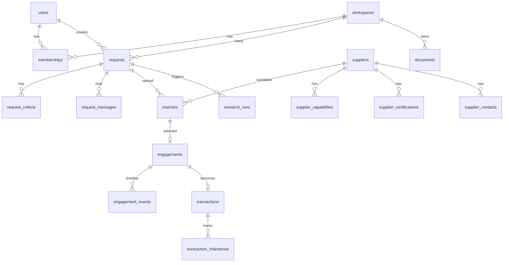

# OSI — MVP1 Technical Backlog

> Companion to [PLAN.md](PLAN.md). Data model + epics → tasks. Living document.

## Architecture (decided)

Monolith on the existing TanStack Start app (Nitro server = API host), deployed as
the standalone Node container we already ship.

| Concern          | Choice                                                                        |
| ---------------- | ----------------------------------------------------------------------------- |
| Database         | **PostgreSQL 16** (compose service, named volume)                             |
| ORM / migrations | **Drizzle** + drizzle-kit                                                     |
| Background jobs  | **pg-boss** (queue lives in Postgres — no Redis to operate)                   |
| Auth             | **better-auth** (TS-native, Drizzle adapter) — email/password + sessions      |
| Validation       | **zod** on every API boundary                                                 |
| AI               | **Claude API** via the `src/server/ai/` gateway — reserved for **supplier research (E4)**, report drafting (E7) and the flag-gated chat (`AI_CHAT`, default off). The pre-search prompt analysis was removed (2026-08-05): criteria are parsed synchronously at intake (`src/server/parse-criteria.ts`, zero tokens), guided by the hero prompt's info helper |
| File storage     | Local Docker volume for MVP1, S3-compatible interface from day one            |
| Email            | SMTP provider (Resend or similar), templates FR/EN                            |

**Tenancy rule:** every buyer-facing query is workspace-scoped. **Exception by design:
`suppliers` and their satellite tables are platform-global** — the supplier dataset is
OSI's shared asset, enriched by every request. Requests, engagements, transactions,
documents are tenant-scoped.

---

## 1 · Data model



### Identity & tenancy

| Table                    | Key fields                                                                                            | Notes                                                                                                                                                                                                                                  |
| ------------------------ | ----------------------------------------------------------------------------------------------------- | -------------------------------------------------------------------------------------------------------------------------------------------------------------------------------------------------------------------------------------- |
| `users`                  | email (uq), name, locale `fr\|en`, `platform_role` `user\|owner\|manager\|accountant`, email_verified | `platform_role` = OSI **employee** roles (gates the admin backoffice): `owner` (full control) · `manager` (ops: facilitation, supplier verification) · `accountant` (finance: transactions, payments). `user` = regular buyer, default |
| `workspaces`             | name, slug (uq)                                                                                       | The company account                                                                                                                                                                                                                    |
| `memberships`            | workspace_id, user_id, role `owner\|admin\|buyer\|viewer`                                             | uq(workspace, user)                                                                                                                                                                                                                    |
| `invitations`            | workspace_id, email, role, token, invited_by, expires_at, accepted_at                                 |                                                                                                                                                                                                                                        |
| `sessions` / auth tables |                                                                                                       | Managed by better-auth                                                                                                                                                                                                                 |

**Workspace roles** (buyer companies): `owner` (everything + delete workspace) · `admin`
(members, settings) · `buyer` (create requests, select suppliers, engagements) · `viewer`
(read-only).

**Platform roles** (OSI employees, decided 2026-08-04): `owner` (full platform control) ·
`manager` (ops — facilitation queue, supplier verification, imports) · `accountant`
(finance — transactions and payment oversight). Stored on `users.platform_role`;
regular buyers keep the default `user`.

**One dashboard for everyone (decided 2026-08-04):** there is **no separate admin
backoffice app**. Every user gets the same shell/dashboard; features are added or
removed based on role. Employee features (facilitation queue, supplier verification,
imports, finance) appear as extra role-gated navigation sections in the shared
dashboard. Feature→role mapping lives in `src/lib/roles.ts`:
facilitation/verification/imports → `owner|manager` · finance → `owner|accountant`.

**Per-user dashboard (decided 2026-08-04):** after login every user lands on _their own_
dashboard — greeting, stats, "Vos dossiers récents" and activity feed scoped to **them**
(their requests + their engagements). Workspace-wide visibility follows the role
(owner/admin see all workspace requests; buyer manages their own; viewer reads all).
Signup creates a personal workspace, so solo users are fully isolated by construction.

**Data visibility across workspaces (decided 2026-08-04):** buyers see **their own
workspace only**. Employees see the buyers' data _plus_ their own, except what their
role forbids: `owner`/`manager` see **all** sourcing dossiers platform-wide;
`accountant` is **forbidden** from buyers' sourcing dossiers — their cross-workspace
domain is finance (transactions, E8). Policy centralized in `src/lib/roles.ts`
(`canSeeAllRequests`).

**Employee view pattern (implemented 2026-08-04):** every data surface for
`owner`/`manager` splits into **"Vue globale"** (all buyers' data, workspace badges) and
**"Mes données"** (their own) via the shared `EmployeeTabs` component — on the home
dashboard (stats + dossiers récents move together), `/demandes` (real data both tabs),
`/fournisseurs`, `/transactions`, `/documents` (showcase/placeholder under Vue globale,
truthful empty state under Mes données until E4/E8), and `/interne/facilitation`.
Buyers and `accountant` never see the tabs — own workspace only.

**Public landing / auth gate (decided 2026-08-04):** the default page (`/`) requires
**no login** — anonymous visitors see the hero prompt and value props and can type their
need. Clicking **“Lancer l’analyse IA” is the auth gate**: it redirects to login/signup,
the typed draft (+ attachments intent) is preserved across the redirect, and the request
is created automatically right after auth. Every other app route (demandes, fournisseurs,
transactions…) requires login. Logged-in users see the personal dashboard on `/`.

### Requests (demandes)

| Table                 | Key fields                                                                                                                                            | Notes                                                                                                    |
| --------------------- | ----------------------------------------------------------------------------------------------------------------------------------------------------- | -------------------------------------------------------------------------------------------------------- |
| `requests`            | workspace_id, created_by, title, description_raw, status, locale, launched_at, completed_at                                                           | status: `draft → received → analyzing → searching → validating → report_ready` (+ `closed`, `cancelled`) |
| `request_criteria`    | request_id, category `material\|flow\|pressure\|certification\|quantity\|lead_time\|other`, label, value, unit, required, source `ai\|user`, position | AI-extracted, user-editable                                                                              |
| `request_messages`    | request_id, role `user\|assistant`, content                                                                                                           | The per-request AI chat                                                                                  |
| `files`               | workspace_id, storage_key, filename, mime, size, uploaded_by                                                                                          | Generic file store                                                                                       |
| `request_attachments` | request_id, file_id                                                                                                                                   |                                                                                                          |

### Suppliers (platform-global)

| Table                     | Key fields                                                                                                                                                                                                           | Notes                     |
| ------------------------- | -------------------------------------------------------------------------------------------------------------------------------------------------------------------------------------------------------------------- | ------------------------- |
| `supplier` *(built)*      | name, descriptor, country_code, website, description, **provenance** `imported\|ai_researched\|osi_verified`, **verification_status** `unverified\|pending\|verified\|rejected`, confidence_score, risk_level, source_ref, **dedup_key (uq)**, **discovered_by_request_id** | Provenance is first-class. `legal_name` / `employee_range` and the satellite tables are still unbuilt |
| `supplier_capabilities`   | supplier_id, category, label, details jsonb                                                                                                                                                                          | What they can make        |
| `supplier_certifications` | supplier_id, code (ISO9001, CE, ATEX…), valid_until, verified                                                                                                                                                        |                           |
| `supplier_contacts`       | supplier_id, name, email, phone, role                                                                                                                                                                                | Used by ops for outreach  |
| `import_runs`             | source, status, stats jsonb, triggered_by                                                                                                                                                                            | Batch import tracking     |
| `research_run` *(built)*  | request_id, status `running\|succeeded\|failed`, queries jsonb, candidates_found, suppliers_added, error, completed_at                                                                                               | One row per research pass |

### Matching & facilitation

| Table               | Key fields                                                                                                                                                                                              | Notes                                                   |
| ------------------- | ------------------------------------------------------------------------------------------------------------------------------------------------------------------------------------------------------- | ------------------------------------------------------- |
| `matches`           | request_id, supplier_id, rank, compatibility_score, confidence_score, risk_level `low\|medium\|high`, **score_breakdown jsonb**, status `candidate\|presented\|selected\|rejected`                      | uq(request, supplier); breakdown = per-criterion detail |
| `engagements`       | request_id, match_id, workspace_id, supplier_id, requested_by, status `requested → ops_review → contacting_supplier → supplier_responded → connected` (+ `declined`, `abandoned`), assigned_ops_user_id | **The facilitation moment**                             |
| `engagement_events` | engagement_id, type, message, actor_user_id                                                                                                                                                             | Timeline shown to buyer & ops                           |

### Execution & misc

| Table                    | Key fields                                                                                                                                                                   | Notes                  |
| ------------------------ | ---------------------------------------------------------------------------------------------------------------------------------------------------------------------------- | ---------------------- |
| `transactions`           | workspace_id, engagement_id, reference, supplier_id, amount, currency, incoterm, status, expected_delivery_date                                                              |                        |
| `transaction_milestones` | transaction_id, type `order_confirmed\|payment\|manufacturing\|inspection\|shipping\|customs\|delivered`, status `pending\|in_progress\|done`, progress %, occurred_at, note | Manual updates in MVP1 |
| `documents`              | workspace_id, file_id, kind `contract\|certificate\|inspection_report\|customs\|invoice\|report\|other`, request_id?, transaction_id?, supplier_id?                          |                        |
| `notifications`          | user_id, workspace_id, type, payload jsonb, read_at                                                                                                                          | In-app bell            |
| `sourcing_rules`         | workspace_id, preferred_regions[], banned_countries[], required_certifications[], max_lead_time_days                                                                         | Applied by the matcher |
| `audit_log`              | workspace_id?, actor_user_id, action, entity_type, entity_id, meta jsonb                                                                                                     |                        |

---

## 2 · Epics → tasks

### E0 — Dev foundations

- [x] Enable `database` (postgres:16) in both compose files: volume, healthcheck, `depends_on`
- [x] `DATABASE_URL` wiring — secrets in `.env.local`, never in committed `.env`
- [x] Drizzle + drizzle-kit: schema layout in `src/database/`, migration workflow, `npm run db:migrate` / `db:seed`
- [x] API route structure under TanStack Start (`/api/*` upload/download routes, zod on every server fn) — typed error envelope still ad-hoc
- [x] pg-boss bootstrap + worker entrypoint (`src/worker.ts`, separate compose service, same image) — jobs: criteria extraction + pipeline
- [x] Seed script: demo accounts per role (named after the role) + 6 demo dossiers for the buyer — suppliers arrive with E4

### E1 — Auth & user management

- [x] better-auth setup (email/password, argon2, httpOnly session cookie)
- [x] Signup flow → creates user + personal workspace (owner)
- [ ] Email verification + password reset (token + email)
- [x] Login/logout UI (new routes) — bilingual
- [x] Route guards: `/` public (anonymous = hero + value props; logged-in = personal
      dashboard); all other app routes require auth
- [x] **“Lancer l’analyse IA” auth gate**: anonymous click → preserve the typed draft →
      login/signup → auto-create the request and resume the flow (no retyping)
- [ ] User profile: name, locale (persist language server-side, sync with the existing toggle)
- [ ] `platform_role` on users; guard helper `requireStaff()`
- [ ] Rate limiting on auth endpoints
- [x] Quick-login facilitator on /login (Buyer/Manager/Accountant/Owner) — always in dev builds, elsewhere via runtime `SHOW_TEST_LOGIN=true` (on during the test phase; off before real users)
- [x] Shell session from router context (no stale "Se connecter" after sign-in/out)

### E2 — Workspaces, roles & tenancy

- [ ] Workspace CRUD (create at signup, rename)
- [ ] Memberships + role checks: `requireRole(workspace, 'buyer')` helpers
- [ ] Tenancy scoping utility — every query filtered by workspace_id (make the safe path the easy path)
- [ ] Invitations: send (email), accept (join flow), revoke
- [ ] Team management UI in Paramètres (list, invite, change role, remove)
- [ ] Audit log writes on auth/membership mutations

### E3 — Requests core loop

- [x] `requests` CRUD + status state machine (guarded transitions in `src/lib/request-status.ts` + `src/server/requests.ts`, launchedAt/completedAt timestamps, request_event trail)
- [x] Hero prompt → creates request (sequence ids from 3000; draft→received + extraction job; post-auth draft auto-creates)
- [x] File upload endpoint + storage adapter (`/api/upload`, `/api/files/$id`, local volume behind S3-shaped `src/server/storage.ts`)
- [x] **Criteria at intake** — the pre-search AI analysis was **removed entirely (decided 2026-08-05)**: an ℹ️ info helper on the hero prompt guides buyers to structured input, and `src/server/parse-criteria.ts` parses criteria synchronously at creation (zero tokens). Requests go **straight to supplier search** — no pause, no `AI_PROMPT_ANALYSIS` flag. Legacy `analyzing` dossiers keep a manual launch button.
- [x] Criteria review/edit UI (add/remove/edit) — editable on the dossier until it closes
- [x] **Per-request AI chat** — behind `AI_CHAT` (default **false**: UI + transcripts hidden, server refuses; the hero prompt is the only AI-facing input): message → Claude with criteria context → optional criteria mutations applied (persisted in `request_message`)
- [x] Worker recovery sweep: requests stranded mid-pipeline (crash/lost enqueue) are re-adopted on boot + every 60s
- [x] Pipeline orchestrator job: `analyzing → searching → validating → report_ready` with progress events — **simulated stages (~10s each) until E4/E5 provide real search/matching**
- [x] Wire demandes list + detail pages to real data (drop mock) — `request` table (migration 0001), workspace-scoped queries; detail criteria/top-5/chat remain showcase until E3/E5
- [x] **Personal dashboard** (Accueil): real session user greeting, stats + "Vos dossiers
      récents" scoped to the logged-in user, per-role workspace visibility
- [ ] Activity feed: recent events across _my_ requests/engagements (from engagement_events + status changes)

### E4 — Supplier data platform

- [x] Supplier schema core (provenance, verification_status, confidence, risk — platform-global) — satellites (capabilities, certifications, contacts) still pending
- [ ] CSV/JSON import pipeline v1 + `import_runs` (admin-triggered) — seed script stands in for now
- [x] **Job: AI research agent** (2026-08-16) — real web search per request, results persisted as `ai_researched` suppliers, `research_run` rows for the audit trail. Runs in the `searching` stage behind `AI_RESEARCH` (default **on**). Gateway: `src/server/ai/research.ts`; orchestration + persistence: `src/server/research.ts`
- [x] **Attachment reading** (2026-08-16) — buyer uploads are opened, not just stored: text/CSV decoded directly, PDF and images read by the model. Criteria parsed out of them with the same intake regexes, and the content feeds the search brief (`src/server/attachments.ts`)
- [x] Dedup / entity resolution v1 — normalized `name|COUNTRY` key on `supplier.dedup_key` with a **unique index**, so a repeat search cannot re-add a known company (`src/lib/supplier-key.ts`). **Merge tool in admin still pending**
- [x] Supplier directory UI wiring (list) — real data with match counts, plus a link back to the request whose research found each company (workspace-gated). Detail page + filters still pending
- [ ] Country risk reference table (seed data)

### E5 — Matching & scoring

- [ ] **Define the 32 compatibility criteria** (product workshop — weights per category)
- [x] **Matching v1 — criteria-aware** (2026-08-16). v0 never read the criteria at all (confidence + verification + risk + a hash jitter), so a supplier that genuinely matched could rank below one that did not. v1 scores each criterion against the supplier's own text: `10 base + 55×coverage + 20×confidence/100 + verification(12/5/0/−25) − risk(0/4/10)`, required criteria weighted ×2, ties broken deterministically. `sourcing_rules` still unused (E11)
- [x] Compatibility score: weighted per-criterion, **breakdown persisted in `match.score_breakdown` jsonb** — which criteria matched, which were unverifiable, how each modifier landed
- [ ] **Numeric criteria are scored as `unverifiable`, not as misses** — pressure/flow/quantity/lead_time cannot be checked against a one-line supplier description, so they are excluded from the denominator rather than penalising every supplier equally. They become checkable once `supplier_capabilities` / `supplier_certifications` exist
- [ ] Confidence score: provenance + profile completeness + verification
- [ ] Risk level: country risk + data flags (v1 heuristic)
- [x] Top-5 persistence in `match` + ranking; "N fournisseurs analysés" is real (matches.created event)
- [ ] Comparison view wiring ("Comparer" side-by-side)

### E6 — Facilitation (engagements) · the OSI moment

- [x] Ops list view on `/interne/facilitation`: all buyer dossiers + Vue globale/Mes données tabs (engagement queue below still pending)
- [ ] Engagement creation from a match (buyer clicks "Engager" on a Top-5 supplier)
- [ ] Status machine + `engagement_events` timeline
- [ ] Ops queue in admin: list, assign to ops user, transition statuses, add notes
- [ ] Buyer-side status panel on request detail ("OSI is connecting you…")
- [ ] Notifications on every transition (buyer + assigned ops)

### E7 — Report generation

- [x] Report data assembly (2026-08-16) — `/demandes/$id/rapport`: the need in the buyer's own words, criteria applied, ranked suppliers with scores/risk, and a methodology section citing the research pass
- [x] "Voir le rapport" button wiring + download — the button now opens the report; **Télécharger en PDF** uses the browser's own print-to-PDF (print stylesheet in `src/styles.css`, chrome hidden via `print:hidden`)
- [ ] **Server-rendered PDF stored as a `documents` row** — needs the `documents` table (unbuilt) and Playwright/Chromium in the image. The route is the seam that feeds it; browser print covers the need until then

### E8 — Transactions (tracking only)

- [ ] Create transaction from a `connected` engagement (ops action)
- [ ] Milestones CRUD — manual updates by ops, manufacturing progress %
- [ ] Buyer timeline UI wiring (page exists) + linked documents

### E9 — Notifications

- [ ] `notifications` table + API (list, mark read)
- [ ] Bell dropdown UI (badge exists — make it real)
- [ ] Email sender + FR/EN templates (verification, invitation, engagement updates)

### E10 — Admin backoffice (`/admin`, staff-gated)

- [ ] Layout + `requireStaff` guard
- [ ] Facilitation queue (E6 surface)
- [ ] Supplier management: search, edit, **verification workflow** (`unverified → pending → verified`), merge duplicates
- [ ] Import runs: trigger, monitor, error report
- [ ] Ops dashboard: counts (open engagements, pending verifications, active requests)

### E11 — Settings

- [ ] Profile + language (server-persisted)
- [ ] Sourcing rules UI → consumed by matcher (E5)
- [ ] Notification preferences

### Cross-cutting (throughout)

- [ ] Audit log on all mutations of money/status/membership
- [ ] Error monitoring hook (server logs first)
- [ ] Postgres backup cron on the VM (`pg_dump` → dated dumps)
- [ ] Security pass before exposing beyond LAN (rate limits, headers, TLS/reverse-proxy)

---

## 3 · Suggested execution order

```
E0 → E1 → E2         (foundations: ~the "login and persist" milestone)
E3 → E4 → E5         (the core loop: request → research → Top 5)
E6 → E7              (facilitation + report = MVP1 demo-able)
E10 in parallel from E4 (admin grows with supplier data)
E8, E9, E11          (execution & comfort)
```

**MVP1 = E0–E7 + E10.** Definition of done: a real buyer signs up, submits a real
need, gets a real Top 5 (imported + AI-researched suppliers, scored), clicks
_Engager_, OSI ops sees it in the queue, buyer sees "connected", downloads the PDF report.

## 4 · Open items

- The 32 criteria list (E5 task — needs a product session)
- External data sources & licensing for imports (E4)
- ~~Web-search provider for the research agent~~ — **decided 2026-08-16: none needed.** Claude's server-side `web_search` tool runs the search inside the existing API call, so there is no second vendor, key or bill. It is called only from `src/server/ai/research.ts`, so a Tavily/Brave adapter can replace it without touching domain code (INFRA principle 4)
- Email provider choice (Resend vs SMTP)
- When to put a reverse proxy + TLS in front of prod (before first external user)
