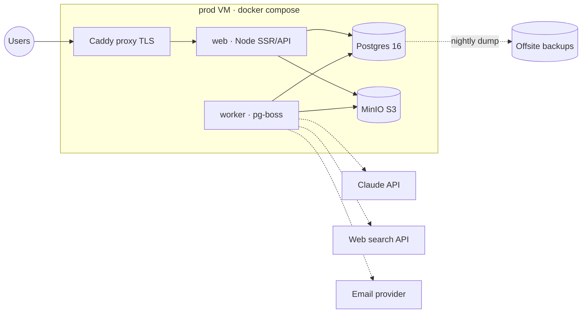

# OSI — Platform Infrastructure Plan

> Companion to [PLAN.md](PLAN.md) and [BACKLOG.md](BACKLOG.md).
> Goal: **modular from day one** — grow by extracting along pre-planned seams,
> never by rewriting. Scale is a series of small moves, each triggered by a
> measurable signal.

## 1 · Principles

1. **Modular monolith, physical seams.** One codebase, but every module behind an
   interface that could become a network boundary. Extraction is a deploy change,
   not a refactor.
2. **Stateless services.** No state in app containers: sessions in Postgres, files
   in object storage, jobs in the queue. Any container can be killed/replicated.
3. **12-factor config.** All environment differences via env vars. Same image runs
   dev, staging, prod.
4. **Everything replaceable.** Each infra component hidden behind a thin adapter
   (storage, email, search, AI) so providers can change without touching domain code.
5. **Scale on signal, not on fear.** Each stage below has an explicit trigger; we
   don't build stage N+1 until the trigger fires.

## 2 · Module map & extraction seams

| Module | Lives in (MVP1) | Seam / extraction path when overloaded |
| --- | --- | --- |
| **Web/SSR + API** | Node container (Nitro) | Stateless → replicate behind the proxy (N containers). Later: split `/api` into its own service if SSR and API scale differently |
| **Workers** (pg-boss) | **Separate container, same image** (`node worker.mjs`) | Scale worker replicas independently; per-queue concurrency; later: dedicated worker VM(s) |
| **AI gateway** | Module `src/server/ai/` — sole owner of Claude API calls, retries, rate limits, cost metering, model tiering | Extract to its own service if multiple apps consume it; budget guards live here |
| **Research agent** | Job type inside workers | Heaviest load → its own queue from day one (`research`), own concurrency knob; first candidate for a dedicated worker pool |
| **Database** | Postgres 16 container + named volume | → pgbouncer → dedicated DB host → managed Postgres (read replicas for analytics) |
| **Queue** | pg-boss (in Postgres) | Keeps ops surface tiny. Seam: JobQueue interface → swap to Redis/BullMQ or SQS only if queue throughput hurts Postgres |
| **File storage** | MinIO container (S3 API) | Same code → any S3-compatible cloud (R2/S3/B2). Never write to local disk directly |
| **Search** | Postgres FTS + trigram indexes | Seam: SearchIndex interface → Meilisearch/Typesense when supplier directory search outgrows SQL |
| **Cache** | None (Postgres is fast enough) | Seam: Cache interface → Redis when hot reads justify it |
| **Email** | Provider adapter (Resend/SMTP), sent via jobs | Provider swap = config change |
| **Notifications** | Table + polling | Seam → SSE/WebSocket gateway when real-time matters |

**Hard rules that make this work:**
- Domain code never imports a vendor SDK directly — always through the adapter.
- Every job idempotent (safe to retry), every handler workspace-scoped.
- One image, three processes: `web`, `worker`, `migrate` (run-once on deploy).

## 3 · Topology by stage

### Stage 0 — today
Single VM (192.168.2.56), compose, web-only, no TLS. Fine for demos on LAN.

### Stage 1 — MVP1 target (same VM, modular compose)

- **Caddy** in front: automatic TLS, gzip, security headers, single entry point
- **web** and **worker** are separate containers from the same image
- **Postgres** + **MinIO** with named volumes + healthchecks
- Nightly `pg_dump` shipped **off the VM** (object storage bucket)
- **Trigger to leave Stage 1:** sustained CPU/RAM pressure, or first paying external users (availability expectations a home VM can't meet)

### Stage 2 — first real load (split hosts, managed data)

- Move Postgres to a **managed instance** (or dedicated node) + pgbouncer
- Object storage to cloud (R2/S3) — MinIO code path unchanged
- **2–3 web replicas** + **dedicated worker pool** (research queue gets its own replicas)
- VM(s) at a cloud provider; home VM becomes staging
- **Trigger to leave Stage 2:** deploy friction across multiple hosts, or worker fleet needs autoscaling

### Stage 3 — horizontal (only if the business demands it)

- Container orchestration: **Docker Swarm or a managed container service — explicitly
  NOT Kubernetes** (decided 2026-08-04; ops overhead not worth it for this team).
  Compose files translate to Swarm stacks almost as-is.
- Extract on evidence: research-agent service, search service, AI gateway service
- Read replica for analytics; CDN for static assets
- Multi-region only if customers require it

## 4 · Where overload will actually hit first (and the lever)

| # | Hotspot | Symptom | Lever (already designed in) |
| --- | --- | --- | --- |
| 1 | **AI research pipeline** | Requests stuck in `searching`; Claude/search API rate limits | Separate `research` queue + per-queue concurrency; add worker replicas; AI gateway meters cost & rate; results persist into supplier DB (**the DB is the cache** — repeat searches get cheaper) |
| 2 | **Claude API cost/limits** | Bill spikes, 429s | Model tiering in the gateway (cheap model for extraction, strong model for research/reports); budget guards per workspace; prompt caching |
| 3 | **Postgres** | Slow matching queries, connection exhaustion | Indexes on every workspace_id + matching columns (day one); pgbouncer; then managed PG + read replica |
| 4 | **SSR under traffic** | Slow TTFB | Replicate web containers (stateless by rule); cache headers on public assets; CDN at Stage 3 |
| 5 | **File storage** | Disk fills VM | MinIO → cloud bucket is a config change |

## 5 · Delivery pipeline — no CI (decided 2026-08-04)

**Builds are local everywhere, prod as in dev.** No CI service, no image registry.

- **Dev**: your machine builds and runs (`scripts/dev.sh` / `scripts/prod.sh`)
- **Prod**: `scripts/deploy.sh` → the VM does `git pull` and builds its own image
  (`docker compose up -d --build`), then restarts and health-checks
- Quality gates run locally before pushing: `npm run lint` + typecheck (make it a habit
  or a git pre-push hook — not a server)
- Rollback = `git checkout <previous-commit>` on the VM + rebuild
- `migrate` runs as a one-shot container before web/worker restart (with E0)
- Seam kept open: if reproducible builds/instant rollback ever matter, a registry can
  be added later without changing anything else — explicitly out of scope for now

## 6 · Environments

| Env | Where | Data | Purpose |
| --- | --- | --- | --- |
| dev | laptop compose (`scripts/dev.sh`) | seeded | daily work |
| staging | prod VM (Stage 1: compose project #2 on other ports) | seeded + anonymized | pre-release checks |
| prod | prod VM → cloud (Stage 2) | real | users |

## 7 · Security & operations baseline (Stage 1, non-negotiable before first external user)

- TLS via Caddy + a real domain (open decision below)
- Postgres/MinIO **not** exposed on host ports in prod (internal network only)
- Secrets in `.env.local` on the VM (never committed); rotate on team changes
- Backups: nightly `pg_dump` + weekly restore **test** (a backup that's never restored doesn't exist)
- Uptime monitoring (external ping) + error alerting (server logs → simple alert first)
- `docker compose` resource limits; log rotation

## 8 · Component catalog — everything the platform may need

> Complete inventory, including components we will **not** enable at first.
> Legend: 🟢 enabled at Stage 1 · 🟡 **dormant** (scaffolded: compose profile or code
> adapter exists, off by default) · ⚪ deferred (documented only, added when triggered).
> Dormant infra services live in `docker-compose.addons.yml` behind **compose
> profiles** — nothing there starts unless explicitly asked:
> `docker compose -f docker-compose.prod.yml -f docker-compose.addons.yml --profile <name> up -d`

### Core runtime
| Component | Role | Default choice | Status | Enable trigger |
| --- | --- | --- | --- | --- |
| Reverse proxy + TLS | Single entrypoint, HTTPS, headers, gzip | Caddy | 🟢 Stage 1 | — |
| Web (SSR/API) | The app | Node/Nitro container | 🟢 | — |
| Worker | Async jobs | Same image, `worker` process | 🟢 with E0 | — |
| Migrate | One-shot schema migration on deploy | Same image | 🟢 with E0 | — |

### Data layer
| Component | Role | Default choice | Status | Enable trigger |
| --- | --- | --- | --- | --- |
| Postgres 16 | System of record | compose service | 🟢 with E0 | — |
| pgvector | Embeddings in PG — **semantic supplier matching** | PG extension | 🟡 (install with E0, use in E5) | Matching quality needs semantics, not just filters |
| pgbouncer | Connection pooling | container | 🟡 profile `dbtools` | Connection exhaustion / many web replicas |
| Read replica | Analytics / heavy reads | managed PG feature | ⚪ | Analytics queries hurt OLTP |
| Object storage | Files, reports, backups | MinIO → cloud S3/R2 | 🟢 profile `storage`, on with E3 | — |
| Redis | Cache + distributed rate limits | redis:7 | 🟡 profile `cache` | Hot reads or multi-replica rate limiting |
| Meilisearch | Supplier directory search | container | 🟡 profile `search` | PG FTS too slow / faceting needs |
| ClickHouse / warehouse | BI at scale | — | ⚪ | Analytics outgrow PG aggregates |

### Async & integration fabric
| Component | Role | Default choice | Status | Enable trigger |
| --- | --- | --- | --- | --- |
| Job queue | All async work | pg-boss | 🟢 with E0 | — |
| Cron scheduling | Recurring jobs (backups, digests, re-scoring) | pg-boss cron | 🟢 with E0 | — |
| Webhooks (outbound) | Notify buyer systems (ERP) of events | in-app dispatcher table + job | ⚪ | First integration customer |
| Real-time gateway | Live pipeline progress, ops queue updates | SSE first, WS later | 🟡 (SSE endpoint seam in E3) | Polling feels laggy |
| API for third parties | Public REST + keys | same API, token auth | ⚪ | First API customer |

### AI stack
| Component | Role | Default choice | Status | Enable trigger |
| --- | --- | --- | --- | --- |
| AI gateway module | Sole Claude API owner: retries, rate/cost metering, model tiering | `src/server/ai/` | 🟢 with E3 | — |
| Web search API | Research agent's eyes | Tavily / Brave (decide E4) | 🟢 with E4 | — |
| Embeddings | Vectorize criteria & capabilities → pgvector | Voyage / provider TBD | 🟡 with E5 | Semantic matching |
| Prompt caching | Cost control on repeated context | Claude prompt caching | 🟢 with E3 | — |
| LLM observability | Trace/eval prompts, cost per request | Langfuse (self-host) | 🟡 profile `llmops` | AI spend > “who cares” threshold, or quality regressions |
| Content translation | Supplier docs FR⇄EN⇄ZH… | Claude via gateway | ⚪ | Cross-language supplier docs in E4+ |

### Observability
| Component | Role | Default choice | Status | Enable trigger |
| --- | --- | --- | --- | --- |
| Structured logs | JSON logs everywhere | pino | 🟢 with E0 | — |
| Log viewer | Browse container logs | Dozzle | 🟡 profile `monitoring` | First “what happened last night?” |
| Uptime monitoring | External ping + alerting | Uptime-Kuma (or SaaS ping) | 🟢 Stage 1 | — |
| Error tracking | Aggregated exceptions | GlitchTip/Sentry | 🟡 profile `errors` | First external user |
| Metrics + dashboards | CPU/RAM/queue depth/latency | Prometheus + Grafana | ⚪ | Capacity planning starts (Stage 2) |
| Tracing | Cross-service latency | OpenTelemetry seam | ⚪ | First service extraction (Stage 3) |

### Security & compliance
| Component | Role | Default choice | Status | Enable trigger |
| --- | --- | --- | --- | --- |
| Rate limiting | Auth + API abuse | in-app (memory) → Redis | 🟢 with E1 | Multi-replica → Redis backend |
| Secrets management | Beyond `.env.local` | SOPS + age (encrypted in repo) | 🟡 | Second operator or second host |
| Upload antivirus | Scan buyer uploads | ClamAV | 🟡 profile `av` | Untrusted external users upload files |
| WAF / intrusion | Block scanners/bots | CrowdSec (Caddy plugin) | ⚪ | Public internet exposure |
| 2FA | Account hardening | TOTP via better-auth | 🟡 with E1 | Before external users |
| SSO / OIDC | Enterprise buyer login | better-auth OIDC | ⚪ | First enterprise deal |
| Sanctions screening | Supplier compliance (risk score input) | OpenSanctions API | 🟡 with E5 risk | Risk scoring v2 |
| Row-level security | DB-enforced tenancy | PG RLS | ⚪ | Compliance requirement / audit |

### Product & business services
| Component | Role | Default choice | Status | Enable trigger |
| --- | --- | --- | --- | --- |
| Email delivery | Auth + notifications | Resend/SMTP adapter | 🟢 with E1 | — |
| PDF rendering | Reports | in-process (Playwright/Chromium) | 🟢 with E7 | Extract to service if it hogs memory |
| Feature flags | Gradual rollout | DB table + helper → Unleash | 🟡 with E0 (table) | Team > 2 or A/B needs |
| Product analytics | Funnels, usage | PostHog/Plausible (SaaS or self-host) | ⚪ | Post-MVP1 growth work |
| Company enrichment | Auto-fill supplier data | OpenCorporates & co. | ⚪ | Import pipeline v2 |
| FX rates | Multi-currency transactions | ECB/API adapter | 🟡 with E8 | Non-USD/EUR transactions |
| Geocoding / maps | Supplier map views | OSM/Nominatim | ⚪ | A map feature is asked for |
| E-signature | Contracts in Documents | Documenso (self-host) / DocuSign | ⚪ | Phase 3 documents |
| Payments / escrow | Real money movement | provider TBD | ⚪ | Phase 4 decision |
| Accounting export | CSV/ERP export | in-app export | ⚪ | First finance-team request |

### Delivery & DR
| Component | Role | Default choice | Status | Enable trigger |
| --- | --- | --- | --- | --- |
| CI / registry | — | **none — decided against.** Builds are local everywhere (dev machine & VM) | ⚪ | Only if reproducible builds / instant rollback become a real need |
| Local quality gates | lint/typecheck before push | npm scripts (optional pre-push hook) | 🟢 | — |
| Build-on-VM deploy | VM pulls `main`, builds, restarts, health-checks | `scripts/deploy.sh` | 🟢 today | — |
| Staging env | Pre-prod checks | compose project #2 on VM | 🟡 | First risky migration |
| DB backups | Nightly dump, offsite | pg_dump + restic → bucket | 🟢 with E0 | — |
| Restore drills | Prove backups work | monthly scripted restore | 🟢 with E0 | — |
| Volume snapshots | MinIO/uploads backup | restic same bucket | 🟢 with E3 | — |

## 9 · Open decisions

- **Domain name** for the platform (needed for TLS/emails)
- Cloud provider for Stage 2 (Hetzner/OVH/Fly/AWS — cost vs ops comfort)
- Web-search API for the research agent (Tavily / Brave / SerpAPI)
- Email provider (Resend vs SMTP relay)
- Error-tracking tool (Sentry self-hosted vs SaaS) — can wait, logs first
