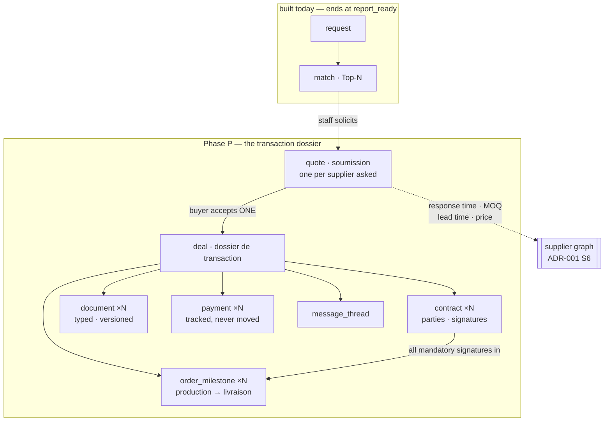
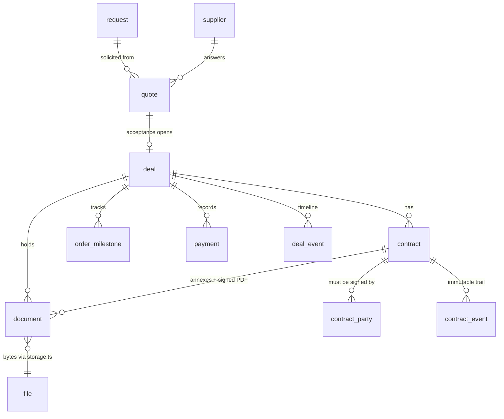
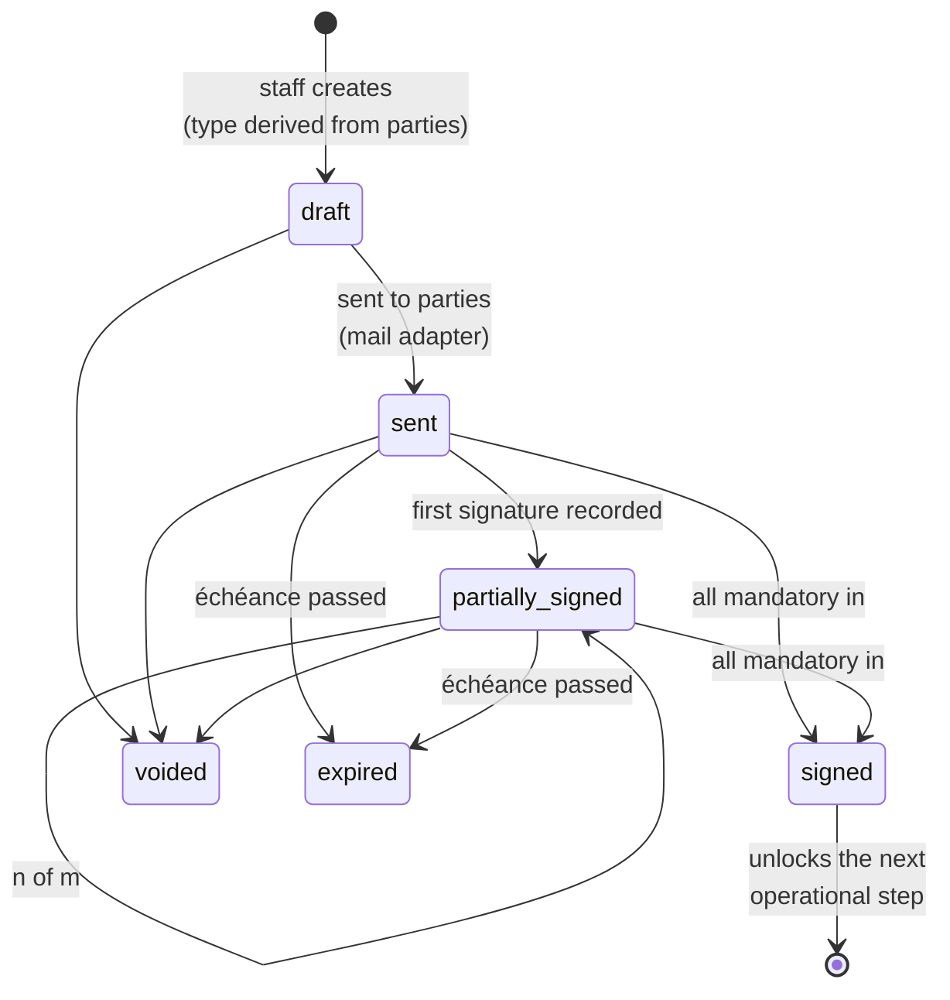

# ADR-002 — The transaction dossier & the contract centre

| | |
|---|---|
| **Status** | ✅ **Accepted** (owner, 2026-08-29 — the four blocking questions answered; see "Settled at acceptance") |
| **Baseline** | main @ `b9add64` · prod deploy #11 · tag `deploy-11-baseline` |
| **Source brief** | [doc/briefs/portail-entreprise.md](../briefs/portail-entreprise.md) (owner's `.docx`, 2026-08-29) |
| **Pretty version** | Claude artifact (diagrams, FR, design switch): <https://claude.ai/code/artifact/6bb88882-9f35-4a7c-b24d-c18c33b5e3f9> |
| **Implementation plan** | Phase P in [doc/BACKLOG.md](../BACKLOG.md) |
| **Retires** | **The entire E6 facilitation sketch and the E8 transaction sketch** — see "What this retires" below. Also the "facilitation last" priority (2026-08-26) and the E6 build gate (2026-08-23). |

## Context

OSI stops at `report_ready`. The buyer gets a ranked Top-N and a printable
report, and then the product ends — the facilitation that gives the company its
name has never been built (E6 has no tables; `/transactions` and `/documents`
render showcase constants from `src/data/osi.ts`).

The owner's brief asks for the rest of the cycle, and states the intent
plainly: *"donner l'impression qu'OSI orchestre la transaction complète, et non
seulement la recherche de fournisseurs."* Eleven tabs, of which
**Contrats is the declared development priority** — a contract centre with
multi-party signature, reminders, an immutable audit trail, versioning, and a
nine-step flow (§4) that turns an accepted quote into a live transaction.

**The brief brings its own process, and it is not the one the backlog held**
(owner, 2026-08-29). The old E6 design — buyer clicks *Engager* on a Top-N
supplier, an `engagement` row enters an ops queue, the buyer eventually sees
"connected" — does not appear anywhere in the brief and is **not what OSI
does**. The brief's process runs `demande → fournisseurs → **soumissions** →
acceptation → dossier de transaction → contrats → commande → livraison`.
This ADR is written from that process, not adapted to the old one.

Two standing decisions are reversed, deliberately:

- **"Foundation before facilitation — E6 is the LAST step before financial
  activities; do not propose starting it"** (owner, 2026-08-26). The foundation
  track has since closed (accounts, roles-as-data, journal, 2FA, verification
  battery all shipped through deploy #11). ADR-001 already named this loop the
  moat: *"the deal loop is the data-acquisition engine — every facilitation
  produces capability/pricing/responsiveness data that cannot be scraped."*
- **The E6 build gate** (*"do NOT implement until the facilitation flow is
  defined with the user"*, 2026-08-23). The brief's §4 **is** that definition.
  The gate is discharged by this ADR, not ignored.

**Weighting note (unchanged from ADR-001):** OSI is pre-launch — no customers on
dev or prod. There is no funnel to protect, no data to migrate, no backward
compatibility to honour.

## What this retires

| Retired | Why | Replaced by |
|---|---|---|
| `engagement` + `engagement_events` (E6) | Nothing in the brief's process corresponds to a buyer-initiated "engagement". Soliciting a supplier *is* asking for a quote. | `quote` rows (soumissions) |
| The **"Engager"** button on a Top-N supplier | The buyer does not engage a supplier; the buyer accepts an **offer**. Selection happens on the Soumissions tab, with something to compare. | "Demander une soumission" (staff-run) → accept on Soumissions |
| The **ops engagement queue** ("OSI is connecting you…") | "Connected" is not a destination the brief recognises. | The deal dossier — a state anyone can read at a glance |
| MVP1's definition of done — *"clicks Engager, OSI ops sees it in the queue, the buyer sees 'connected', downloads the PDF report"* | Ends one step after the report; the brief ends at a delivered order. | A signed contract and a tracked commande (restated in the backlog) |
| E8's standalone `transaction` sketch | Folded into the same spine rather than bolted beside it. | `deal` + `order_milestone` |

Nothing built is discarded — none of this was ever built. What is discarded is
a **plan**.

## Decision

### 1 · One dossier, three entities

Brief steps 1-2 (*"une soumission est acceptée … OSI crée automatiquement le
dossier de transaction"*) set the spine:

The entities and how they hang together:

**A quote is the unit of facilitation.** Asking supplier X for an offer creates
a `quote` in `requested`; what comes back moves it to `received` with a price,
lead time, MOQ and terms; the buyer compares the received quotes side by side
(the Soumissions tab is a comparison surface, which is why several must exist)
and accepts one. Acceptance is the single event that creates the `deal`.

There is deliberately **no entity between the match and the quote.** The old
design put one there and it earned nothing: an engagement with no offer in it is
a status with no content.

**Quotes carry the moat.** Response time, MOQ, lead time and price per supplier
are exactly the unscrapable outcomes ADR-001's S6 promised to feed back onto the
supplier graph. They arrive as a by-product of the tab the brief asked for.

### 2 · External parties are RECORDS, never users

**Owner decision, 2026-08-29:** *"supplier does not have direct access to the
platform for now (we will include that later), platform staff handle the
interaction with them, maybe through the platform by email."*

Therefore `contract_party` (and `quote.supplier_id`) is a **row describing a
party**, not a membership: it points at a `supplier` or an `organization` when
we have one, and otherwise carries a bare name + email (a carrier we hold no
record of). Same tombstone pattern as `audit_log` — nullable references plus a
name/email snapshot, so the contract stays readable forever regardless of what
happens to the referenced row.

Consequences, all first-class:

- **No party accounts, no scoped guest sessions, no supplier login.** The
  `member` model and every tenancy guard stay exactly as they are.
- The portal has **exactly two audiences**: the buyer (own workspace) and OSI
  staff (internal workspace, via `effectivePlatformRole`). The brief's §6 rows
  for *Fournisseur* and *Sous-traitant* are recorded as **deferred, not
  dropped** — they land with the supplier-side space the README already parks
  behind `supplier_partner.claimed_by_user_id`.
- **Every external interaction is staff-mediated and outbound**: OSI sends, OSI
  records what came back. The platform's job is to make that legible and
  auditable, not to host the counterparty. A quote is *entered by staff*; a
  signature is *recorded by staff*.
- This does **not** weaken multi-party signature — see decision 3.

### 3 · Two signature mechanisms, split by who the party IS

**Owner, 2026-08-29:** *"between buyer and staff it is tracked through the
platform; for supplier it is manual upload for now, as the supplier is not
logged into the platform."*

This falls straight out of decision 2. A `contract_party` may or may not
correspond to a platform user, and that single fact picks the mechanism:

| Party | Mechanism | Evidence recorded |
|---|---|---|
| **Buyer · OSI** (they have accounts) | **signed in the platform** — the signatory opens the contract and signs; no vendor, no email round trip | who (user id + name snapshot), when, IP, user agent |
| **Supplier · transporteur · courtier · inspecteur** (no account) | **manual upload** — staff sends the contract by mail, receives it signed, uploads the countersigned PDF | who signed (name + email as stated), when, the uploaded document, and which staff member recorded it |

Both write the same `contract_party` row and the same `contract_event` trail,
so the `2/4` indicator and the "all mandatory signatures in" transition do not
care which mechanism produced a signature.

`src/server/esign.ts` stays as the vendor seam (same rule as `mail.ts`: no
domain code imports a vendor SDK), now with a narrower job — **it is the
external-party path only**, and its first implementation is `manual`. If a
vendor is ever bought it replaces `manual` for the external parties; the
in-platform half never needed one, because we already know who is signing:
they are authenticated.

**Consequence to hold onto:** the in-platform signature is the stronger of the
two by construction (an authenticated session, not a claim in an email), and
it covers exactly the two parties on every contract that matter most — the
buyer and OSI.

### 4 · Signature evidence is permanent, and does not live in `audit_log`

`audit_log` is **purgeable** — `purgeAuditLogFn` deletes rows older than
`AUDIT_RETENTION_MONTHS = 3`. The brief requires an **immutable** trail for
signatures. These two cannot be the same store.

So: **signature evidence lives on the contract's own rows** (`contract_party`
and `contract_event`) as part of the contract record — never purged, never
FK-cascaded away. `audit_log` keeps recording the *operational* actions around
it (contract created, reminder sent, contract voided) as it does for everything
else. Two trails, two retention rules, on purpose.

### 5 · Required contracts are derived from the parties, never hand-picked

Brief step 3 (*"le système détermine les contrats requis selon les
intervenants"*). A deal with a carrier needs a carrier agreement; one with a
customs broker needs a brokerage mandate. That mapping is a **pure function of
which parties the deal has** (`src/lib/contract-types.ts`, the taxonomy pattern
from S1: a typed module, not a table, until staff need to edit it). Staff can
add a contract the mapping did not predict; staff cannot *silently miss* one the
mapping requires.

### 6 · Documents: one typed table, replacing the showcase constants

A single `document` row — kind (facture · certificat · douane · inspection ·
packing list · B/L · contrat signé · annexe), the deal and/or contract it hangs
from, a `file_id`, an issuer, a version. It absorbs the open E7 item (*"server-
rendered PDF stored as a `documents` row"*) and finally kills the dead constants
in `src/data/osi.ts`.

### 7 · Money is tracked, never moved

Unchanged from the README: payments are **track-only**, escrow deferred, no PSP.
The Paiements tab is a ledger view — dépôts, soldes, factures, frais OSI, état —
and `payment` rows are staff-entered records of things that happened elsewhere.
The brief agrees (§9 defers "paiements avancés").

### 8 · Status machines follow the pattern that already works

Every new entity gets guarded transitions in `src/lib/*-status.ts` (illegal ones
throw, as `request-status.ts` does), and every change writes an event row.
Timelines, the dashboard and the contract history stay **pure read-models of the
database** — the property that makes the request loop debuggable, kept.

The contract machine, which carries the brief's §3.1 filters (Tous · Actifs ·
À signer · En attente · Complétés · Expirés) as derived views, not as columns:

`À signer` = mandatory party still pending. `Expirés` is read-time from the
échéance, no cron — the same trick the Recommandé tier uses.

### 9 · Staff powers stay data — including who may sign

**Owner, 2026-08-29:** *"owner will assign access to each role like manager,
so here in sign can be activated or not; plus roles can be added/created and
access assigned accordingly."*

Two things, and they are not the same size:

- **`contracts.sign` is a permission key** in the existing `platform_permission`
  matrix, alongside `deals`, `contracts`, `contracts.send` and
  `contracts.void`. It defaults to owner-only and the owner flips it per role,
  live, from **Rôles & accès** — exactly the machinery built on 2026-08-28.
  **This is in Phase P** and costs almost nothing: the matrix already exists.
- **Custom staff roles** — creating a role beyond `manager` / `accountant` and
  assigning capabilities to it — is a **new platform feature, not part of this
  ADR**. It is tracked separately (Phase R in the backlog) because it changes
  the role model itself. The good news is the storage is already generic:
  `platform_permission` is keyed by a `role` TEXT column and `user.platform_role`
  is TEXT too, so custom roles are storable today. What is hardcoded is the
  `PlatformRole` union in `src/lib/roles.ts` and the
  `role !== "manager" && role !== "accountant"` short-circuit in
  `src/server/permissions.ts`, plus the absence of any role CRUD surface.
  **The owner is never a row and role granting stays owner-only, forever** —
  that rule survives custom roles unchanged, or the matrix can lock out its
  own editor.

## Settled at acceptance (owner, 2026-08-29)

| Question | Answer |
|---|---|
| Who decides which suppliers are asked for a quote? | **The buyer picks.** They select from their Top-N and ask OSI to solicit; staff do the sending. This adds a buyer-facing selection surface to P2 that the "OSI chooses" answer would not have needed. |
| Which contract types in v1? | **The two unavoidable ones** — mandat OSI↔client and the buyer↔supplier order. Transporteur, courtier, inspection, NDA and annexes follow once the machinery is proven. |
| Who signs for OSI? | **A permission key** (`contracts.sign`), owner-assigned per role from Rôles & accès. Plus a new ask: **custom roles** — see decision 9 and Phase R. |
| E-signature vendor? | **Neither, for now.** Buyer and OSI sign **in the platform**; external parties are **manual upload**. No recurring bill, and the stronger mechanism covers the two parties that matter most. |

Still open, and small enough to default unless the owner objects:

1. **Contract numbering** — `OSI-2026-0042`, per-year sequential, platform-global
   (a `contract_id_seq`, like `request_id_seq`).
2. **Currency** — store it, never convert. Multi-currency dashboard totals would
   need a rate source that does not exist.

## Options considered — external party access

**Option A — scoped party accounts** (each counterparty signs up, sees only
their transactions). Strongest identity assurance on a signature, and the
ground floor of the supplier-side space. Rejected by the owner for v1: it is a
second product (onboarding, support, abuse surface) before the first one has
customers.

**Option B — link-based capability access** (emailed link, no account, view and
sign). Light, and the `/invitation/$id` pattern already exists. Not selected:
it still puts counterparties on our surface, and a self-hosted signing page has
weaker evidentiary standing than either a real e-sign vendor or a signed PDF on
file.

**Option C — no external access at all, staff-mediated (SELECTED).** OSI is the
middleman; the platform is OSI's and the buyer's instrument for running that.
Cheapest to build, matches how the business actually operates today, and
forecloses nothing — A and B both remain reachable later, since parties are
already modelled as rows that a `claimed_by_user_id` can point at.

## Implementation plan (= Phase P in the backlog)

**Start, in dependency order:** P1 schema spine · P2 soumissions (request a
quote, record what came back) · P3 comparison + acceptance → deal · P4 contract
centre (list, fiche, parties) · P5 templates & pre-fill · P6 signature tracking,
reminders, `esign.ts` + manual provider · P7 commandes & milestones · P8
documents module · P9 paiements ledger · P10 messages · P11 rapports.

**Gates:** G1 e-sign vendor choice (budget) · G2 supplier-side access
(owner-deferred).

## Conflicts with decisions already made

Every point where the brief contradicts something recorded or built. Nothing
here is resolved unilaterally — the ones marked ❓ need the owner.

| # | The brief says | It contradicts | Resolution |
|---|---|---|---|
| 1 | Contrats is the development priority | *"Foundation before facilitation — E6 is the LAST step; do not propose starting it"* (owner, 2026-08-26) | ✅ Reversed by the brief itself; foundation track has closed |
| 2 | §4 defines the facilitation flow | The E6 build gate, *"do NOT implement until the flow is defined with the user"* (2026-08-23) | ✅ Gate discharged — the brief IS the definition |
| 3 | Process runs soumission → acceptation → dossier | The E6 task list (Engager → engagement → ops queue → "connected") and E8's standalone transaction | ✅ Retired — see "What this retires" (owner, 2026-08-29) |
| 4 | §6 grants **Fournisseur** and **Sous-traitant** portal access | The owner's own later instruction (2026-08-29): suppliers have **no** platform access; staff mediate | ✅ Owner's instruction wins — §6's last two rows are out of scope v1 (gate G2). *Do not build from §6.* |
| 5 | §7 *"piste d'audit immuable"* | `audit_log` is **purgeable at 3 months** (`AUDIT_RETENTION_MONTHS`, owner: *"we can delete a log older than 3 month"*) | ✅ Two trails: signature evidence lives on contract rows (permanent), audit_log keeps operational actions (purgeable). Decision 4 |
| 6 | §7 API de signature électronique | No paid vendor exists in the stack; the owner's hard constraint bans paid **data** providers — e-sign is not one, but it is the **first recurring bill** | ❓ Gate G1. The `manual` provider ships v1 so the module is not blocked either way |
| 7 | §7 *"politique de rétention"* for documents | No retention policy exists, and `storage.deleteFile` **is never called on user files** (known debt) — deleting a request drops its `file` rows and leaves the bytes | ❓ Needs a policy before legal documents land |
| 8 | Contracts, signed PDFs, B/L scans stored in the portal | **`scripts/backup.sh` dumps Postgres only. The `osi-uploads` volume is not backed up anywhere.** Today that risks re-uploadable spec sheets; with signed contracts it risks the legal record | ❗ **Must fix before P8.** Not a design question — a gap |
| 9 | Dashboard KPI *"Économies totales — 348 750 $"* | Nothing in the data model can compute a saving: there is no baseline price to compare against | ❓ Either capture a buyer-stated target/market price on the request, or drop the tile. The repo's honesty rule (numeric criteria are `unverifiable`, not misses) applies |
| 10 | Visual notes *"Next.js"*, *"AWS S3"* | The app is TanStack Start; storage is a local volume behind an S3-shaped adapter, and *"no cloud provider"* is a recorded infra decision | ✅ Graphic-designer notes, not requirements — ignored |
| 11 | Eleven tabs for every client | Plans gate `requests_per_day` / `suppliers_returned` only; a Free trial (1/day, 2 lifetime) would reach contracts and payments | ❓ Does the deal layer become a plan dimension, or is it open to everyone with a deal? Affects E12 |
| 12 | Notifications for signatures, reminders, milestones | The E9 registry holds exactly **two** types (`report_ready`, `invitation_accepted`) | ✅ Extension, not conflict — each new type is one registry entry + prefs row |
| 14 | §8 *"conserver l'identité actuelle d'OSI"* — a **dark** anthracite palette | The app's actual default is **light** (`:root` in `styles.css`); the brief describes a design the app does not currently render | ✅ Resolved as **two designs, user-switchable** (decision 10). The `.dark` block already exists in the stylesheet and is never applied — wiring it is the task |
| 15 | Tableau de bord as its own tab | `/` currently *is* the dashboard for signed-in users, and the public hero for anonymous ones | ✅ Split: new dashboard route, home renamed (decision 11). ❓ **What the home is renamed to is unanswered** |
| 13 | Rapports: *"performance fournisseur"* | Requires quote/deal outcomes that do not exist yet | ✅ Arrives free once quotes accumulate (ADR-001 S6) — it is a late phase, not a v1 tile |

**Not in conflict, and worth knowing:** the palette (`#D4AF37`/`#111111`/
`#1E1E1E`) already matches `src/lib/themes.ts`; multi-tenant isolation, RBAC as
data, the audit journal, notifications and the responsive shell all exist. The
brief's §7 "exigences techniques" is largely a description of what deploy #11
already does.

**One priority question the brief does not answer:** pick-up item ⓪, the search
relevance gate. The Top-N feeding these quotes is currently unreliable (a
verified supplier scores ~41 % with zero criteria matched, and can store-hit any
request). Orchestrating a transaction on top of that orchestrates the wrong
deal. It is a small fix and it is not part of Phase P — but it should land
before, or alongside, P2.

## Consequences

- **E6 and E8 stop existing as designed.** The epics survive as names for the
  work; their task lists are replaced by Phase P.
- MVP1's definition of done is restated: *a buyer submits a need, gets a Top-N,
  OSI solicits quotes, the buyer accepts one, the contracts are signed, and the
  commande is tracked to delivery.*
- The buyer nav roughly doubles. The disabled-not-hidden rule means every new
  tab renders greyed until it has data behind it, so the shell can land ahead of
  the modules without lying about what works.
- **Cost shape barely moves.** None of this calls Claude; the spend stays in
  research. The one recurring bill would be an e-sign vendor, which G1 defers
  and the manual provider makes optional.
- Pick-up item ⓪ (the search relevance gate) is **not** superseded. A portal
  that orchestrates a transaction built on an irrelevant Top-5 orchestrates the
  wrong deal — the fix stays a prerequisite for real buyers, whatever order it
  is built in.
- **ADR-001's S6 lands for free.** Quote outcomes are the feedback loop; the
  supplier graph starts accumulating what cannot be scraped from the first
  soumission recorded.

## Open questions

Resolved at acceptance — see the table above. What remains:

1. **Contract numbering** and **currency** (defaults proposed above).
2. **Custom staff roles** (Phase R) — needs its own sizing before it is
   scheduled; it is not a prerequisite for any Phase P task, since
   `contracts.sign` works on the existing roles from day one.
